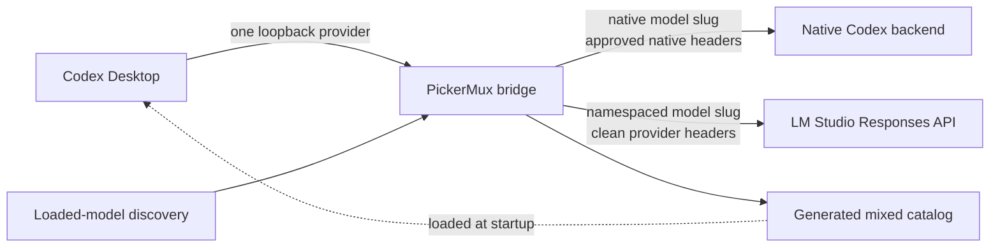

# PickerMux

[](https://github.com/patrickschiller/pickermux/actions/workflows/ci.yml)
[](LICENSE)
[](#requirements)
[](#requirements)

**Use local LM Studio models directly from the Codex Desktop picker.**

PickerMux makes local models feel like a first-class part of Codex Desktop. Load
a model in LM Studio, refresh PickerMux, and select it from the same familiar
model picker—without maintaining separate Codex profiles, repeatedly editing
providers, or switching to a separate local-only workflow.

Your existing Codex models remain in place while PickerMux adds clear,
namespaced entries for the local models that are actually loaded. The result is
a fast local-model workflow with accurate context information, model-specific
reasoning levels, and a strict routing boundary between native and external
providers.

Version 0.6.0 introduces **Efficient Fidelity**: certified LM Studio models can
keep the complete Codex coding harness while deferring large tool schemas until
the model asks Codex to find the relevant tools.


*Load models in LM Studio, refresh PickerMux, and select them directly in Codex
Desktop.*

PickerMux is an unofficial community project. It is not affiliated with,
endorsed by, or supported by OpenAI, Codex, or LM Studio.

## Requirements

- macOS on Apple silicon or Intel;
- Codex Desktop installed, opened once while signed in, and then fully quit;
- LM Studio with its local server enabled and at least one LLM loaded;
- Node.js 22.15.0 or newer with native Zstandard support;
- a valid account model cache created by the installed Codex Desktop build.

The cache must match the installed Codex client version. Its age alone does not
make it invalid or require an uninstall.

PickerMux is macOS-specific because it uses LaunchAgents, LaunchServices, and
the macOS Keychain. The installer runs entirely as the current user: it neither
uses `sudo` nor edits shell startup files.

Confirm that the required Node.js runtime is visible in the terminal before
installing:

```bash
node --version
```

The command must report `v22.15.0` or newer. If it reports `node: command not
found` or `env: node: No such file or directory`, install a supported Node.js
release, open a new terminal, and rerun the check.

## Install

After satisfying the requirements above, install the latest release with one
command:

```bash
/usr/bin/curl --proto '=https' --proto-redir '=https' --tlsv1.2 -fsSL https://github.com/patrickschiller/pickermux/releases/latest/download/install.sh | /bin/sh
```

The release installer downloads an exact versioned archive, verifies its
embedded SHA-256 digest, rejects unsafe archive entries, and then hands off to
PickerMux's transactional setup lifecycle. It stores versioned CLI files below
`~/Library/Application Support/PickerMux` and exposes the command as
`~/.local/bin/pickermux`.

If `~/.local/bin` is not already in `PATH`, the installer prints the exact
one-time shell configuration needed. It does not change `.zprofile`, `.zshrc`,
or another shell file automatically. Until then, use the absolute command path.

For a reproducible installation, replace `latest` with an exact release:

```bash
/usr/bin/curl --proto '=https' --proto-redir '=https' --tlsv1.2 -fsSL https://github.com/patrickschiller/pickermux/releases/download/v0.6.0/install.sh | /bin/sh
```

Both one-line forms execute code downloaded from GitHub. The archive checksum
protects against corruption or asset substitution after the installer starts,
but the bootstrap still trusts HTTPS, GitHub, and the maintainer account. To
review it first, download `install.sh`, inspect it locally, and execute the saved
file only after you are satisfied.

Reopen Codex Desktop after setup. The mixed catalog is loaded only at process
startup, so closing a window is not enough: use **Codex > Quit Codex** or press
`Command-Q` before reopening it.

The included configuration expects LM Studio at
`http://127.0.0.1:1234/v1`. To use a trusted remote Mac over Tailscale or add
another Responses-compatible provider, create the custom configuration first
and follow the managed setup procedure in
[Configuration](docs/CONFIGURATION.md).

## Verify the installation

```bash
~/.local/bin/pickermux --version
~/.local/bin/pickermux status
~/.local/bin/pickermux doctor
~/.local/bin/pickermux discover
```

For this release, the first command must print `pickermux 0.6.0`. `status`
checks the managed configuration, catalog, compatibility contract, and bridge.
It also reports `full-refresh=idle` normally or the current recovery phase;
`status --json` exposes the same state as `fullRefresh.status` and
`fullRefresh.phase`. `discover` lists the LLMs currently loaded in LM Studio.
`doctor` is deterministic and does not submit a model prompt. Its independent
`codex-account-cache` check reports whether the signed-in account cache matches
the installed Codex client even when the bridge runtime or mixed catalog is
absent. Use `pickermux doctor --live` only when you intentionally want a real
LM Studio inference check. Once `~/.local/bin` is in `PATH`, the shorter
`pickermux` form is equivalent.

## Daily workflow

1. Start the LM Studio server and load the LLMs you want to expose.
2. Run `pickermux refresh`.
3. Fully quit and reopen Codex Desktop.
4. Select the namespaced LM Studio model from the normal Codex model picker.

Normal `refresh` does not warn merely because the matching Codex account cache
is old. Its fetch time and neutral age remain visible through `doctor`.

## Refresh native account visibility

Use the opt-in recovery mode when a newly entitled native model is missing or
PickerMux reports that the account cache does not match the installed Codex
client:

```bash
pickermux refresh --full
```

This is an interactive macOS lifecycle operation, not the normal daily refresh.
Run it from the receipt-active installed PickerMux CLI, not directly from a
development checkout. It first explains that Codex will quit twice and that
active Codex tasks can be interrupted, then requires you to type `FULL` exactly.
`--full` cannot be combined with `--json` or `--config`; it always reuses the
installed service configuration.

After confirmation, a one-time helper performs the recovery independently of
the Codex process:

1. request a graceful Codex quit and verify that the app fully stopped;
2. temporarily suspend the PickerMux integration while retaining its installed
   configuration, certifications, backups, and provider credentials;
3. open Codex without PickerMux and wait for a newly valid account cache that
   matches the installed client version; when a valid starting cache existed,
   the new `fetched_at` must also be later;
4. request another graceful quit, transactionally reactivate the preserved
   PickerMux configuration, and run the normal validation gates;
5. reopen Codex so it loads the refreshed mixed catalog.

PickerMux never escalates a refused or timed-out graceful quit to a forced kill.
The helper uses bounded waits and a private checkpoint. If the sequence pauses
after suspension, rerunning `pickermux refresh --full` and confirming again
resumes that validated checkpoint. It otherwise fails closed rather than
claiming that PickerMux was reactivated successfully. See
[Troubleshooting](docs/TROUBLESHOOTING.md#full-account-cache-refresh-stops-before-completion).

## Text-only performance

PickerMux 0.5.2 reduces prompt-prefill work for newly discovered, uncertified
LM Studio models. Codex Desktop can attach a large generated coding-agent
bootstrap even to a short question. On a text-only route, PickerMux replaces
the donor coding-agent profile with a compact assistant prompt, removes
optional tool schemas, and omits only generated bootstrap fragments that prove
their private semantic kind, expected role, exact shape, and any required
complete envelope.

This optimization does not discard the conversation. User messages,
attachments, conversation history, current environment facts, AGENTS/project
and managed instructions, and explicitly selected skill instructions still go
to the model. Generated cross-thread memory and collaboration/multi-agent
policy carry dedicated private kinds and can be omitted without pinning their
wording to one Codex release. Generic developer context is retained, but no
longer prevents later independently verified generated fragments from being
compacted. A tool-certified model deliberately receives the full coding-agent
prompt and context instead.

For an Efficient Fidelity-certified LM Studio model, the full coding-agent
prompt and context are still retained. Only deferred tool definitions are kept
out of the initial LM Studio request and supplied later through Codex's
client-executed tool search. This reduces schema-prefill work without replacing
or trimming the Codex harness.

The improvement targets time spent processing the input; it does not make the
model generate tokens faster. For a meaningful comparison with LM Studio's
chat UI, start a new short Codex conversation, use an uncertified model, and
compare the uncached prompt tokens and time to first output in LM Studio's
server log. Project context, retained history, model loading, quantization, and
hardware can still dominate latency. See
[Troubleshooting](docs/TROUBLESHOOTING.md#lm-studio-takes-minutes-before-the-first-token)
if a new short turn still sends an unexpectedly large prompt.

`pickermux doctor` can report privacy-safe counters from the most recent
text-only request, including input and forwarded bytes plus omitted and retained
part counts. These counters stay in memory and never contain prompt text,
model/provider names, paths, hashes, or request and conversation identifiers.

## Efficient Fidelity

Efficient Fidelity is the low-overhead tool path for an exact, independently
certified LM Studio model. Codex remains the agent: it keeps the complete
instructions and conversation, searches its own deferred tool inventory,
executes the selected tools, and retains its normal sandbox and approval
controls. PickerMux only translates the public client-executed `tool_search`
round trip to and from LM Studio's supported function-call shape.

On the first model request, deferred function schemas are replaced by one
bounded search function. When the model requests a tool search, Codex performs
that search locally and returns the selected public tool definitions. PickerMux
then exposes only those selected deferred functions to LM Studio for the next
inference; functions that Codex did not defer remain advertised throughout. It
does not choose tools, execute them, approve actions, or act as a separate agent
or broker.

The optimization is additive to direct tool certification and is granted only
to the exact LM Studio model configuration that passes its own live tool-search
probe. If that additional evidence is missing, stale, or fails, the model keeps
the existing Direct fidelity path when its base tool receipt is still valid.
New or base-uncertified models remain text-only. There is no provider-wide
configuration switch that can bypass these model-bound receipts.

Version 0.6.0 deliberately uses Codex's full public replay for the tool-search
round trip and does not use `previous_response_id` as a history-compression or
session mechanism. Stateful continuation optimization remains future work.
Remote compaction can consume completed tool history but cannot create a new
executable call. Native Codex routes are unchanged and byte preserving.

The rejected broader Fast Agent design and the evidence behind this narrower
architecture are recorded in the
[Fast Agent feasibility report](docs/FAST_AGENT_FEASIBILITY.md).

## Upgrade

PickerMux never updates silently. Run the same latest-release installer again
to stage and activate a newer version. A healthy installation is refreshed
transactionally; failed activation restores the previous CLI and bridge state.
The same version is safe to run again, while an implicit downgrade is refused.
Setup checks the account-scoped Codex model cache before staging, repeats the
check under the lifecycle lock, and checks it again immediately before
activation. A missing or client-version-mismatched cache leaves the active
installation unchanged. Once v0.5.4 is active, later account-cache recovery can
use `pickermux refresh --full` without a destructive reinstall. Fully quit Codex
Desktop with `Command-Q` before running setup. After the installer completes,
repeat the
[verification commands](#verify-the-installation), then reopen Codex Desktop so
it loads the new catalog.

## Uninstall

Fully quit Codex Desktop with `Command-Q` before running any uninstall mode.

Remove only the Codex integration, LaunchAgent, and managed runtime with:

```bash
pickermux uninstall
```

To remove the integration and the receipt-owned CLI distribution as well, use:

```bash
pickermux uninstall --remove-cli
```

Verified configuration backups and provider credentials in the macOS Keychain
are deliberately retained in both cases. PickerMux never removes unrecognized
launcher files or distribution paths.

For an explicit full removal, including verified PickerMux backups and every
PickerMux provider credential identified by its private, secret-free provider
registry, use:

```bash
pickermux uninstall --purge
```

`--purge` implies `--remove-cli`. Runtime, CLI, backup, and registry state is
inventoried and revalidated using installation receipts, SHA-256 hashes, and
device/inode identity before exact entries are removed. State observed as
modified, foreign, ambiguous, or concurrently replaced fails closed and remains
available for review; PickerMux does not recursively delete an untrusted
directory. Ownership-sensitive cache, configuration, receipt, runtime, backup,
and registry files are rejected before payload reads when they are symbolic or
multiply linked. The same-user final-syscall race boundary is documented in
[SECURITY.md](SECURITY.md), together with recovery semantics for a partial
multi-item Keychain deletion. Full purge never reads, changes, or removes
native Codex authentication, including `~/.codex/auth.json`.

The canonical `model_bridge` full-purge configuration restoration atomically
leaves one marker-bounded, inert provider table so Codex can still parse
historical PickerMux chats. It has no credentials, targets
`127.0.0.1:0`, and has zero request and stream retries, so new turns fail
locally rather than reaching a provider. A later PickerMux installation removes
only that exact unchanged table as part of its atomic configuration update; a
modified or foreign `model_bridge` table remains a fail-closed conflict. Its
marker records only whether the restored config must remain a file. It is
`false` only when no config existed before installation and no user content
survives restoration; reinstall and a later ordinary uninstall therefore
preserve an absent path, an empty existing file, and any surviving user bytes.

## Why PickerMux

Running a model in LM Studio is straightforward. Using it repeatedly inside
Codex Desktop is where friction usually starts: provider changes, model IDs,
context settings, and separate launch modes interrupt the flow.

PickerMux turns that setup into a short, repeatable workflow while staying
deliberately conservative:

- **Load, refresh, select.** Models currently loaded in LM Studio are discovered
  and added to the normal Codex Desktop picker.
- **One familiar interface.** Move between local models without maintaining a
  collection of Codex profiles or editing configuration for every switch.
- **No fake capabilities.** Context size and reasoning options come from the
  loaded LM Studio instance. PickerMux never inflates a model's context window.
- **Safe model defaults.** Newly discovered external models start in text-only
  mode. The bridge enforces the text-only boundary, reduces verified generated
  bootstrap for faster prompt prefill, and rejects forced tool turns until that
  exact model and configuration pass a live certification matrix. Dedicated
  memory and multi-agent bootstrap remain removable across wording changes,
  while unknown kinds, wrong roles, malformed shapes, and unrecognized
  envelopes are retained conservatively. See
  [Text-only performance](#text-only-performance).
- **Efficient Fidelity.** An additionally certified LM Studio model keeps the
  full Codex harness while Codex supplies deferred tool schemas only when the
  model searches for them. A missing or stale additive receipt falls back to
  Direct fidelity rather than creating a reduced chatbot or a second agent.
- **Credential isolation.** Native Codex authentication and metadata are never
  forwarded to LM Studio or another external provider, including Codex client
  metadata carried inside a Responses request body.
- **Transactional lifecycle.** Install, refresh, rollback, diagnostics, and
  uninstall are designed as one managed workflow rather than a collection of
  manual edits to `~/.codex`.
- **Live compatibility quarantine.** The service rechecks Codex when the
  executable changes and refuses model traffic until PickerMux is refreshed if
  the installed client/catalog contract no longer matches.
- **Small supply-chain surface.** The runtime has no third-party npm
  dependencies.

## How it works

PickerMux uses Codex's documented custom-provider configuration and the
[`model_catalog_json`](https://learn.chatgpt.com/docs/config-file/config-reference#configtoml)
catalog loaded at application startup.



The bridge listens only on `127.0.0.1` behind a randomly generated capability
path. Native model slugs remain on the native Codex route. External model slugs
are namespaced, resolved through an immutable provider registry, and sent with
a newly constructed header set.

See [Architecture](docs/ARCHITECTURE.md) for the complete trust boundary,
catalog lifecycle, request normalization, and certification design.

## Commands

| Command | Purpose |
| --- | --- |
| `pickermux --version` | Print the exact PickerMux release version. |
| `pickermux setup [--config PATH]` | Install a fresh release or transactionally activate it over a healthy installation. |
| `pickermux discover` | List external models that are safe to publish from the current provider state. |
| `pickermux build` | Build and validate a mixed catalog without installing it. |
| `pickermux install` | Install the catalog, managed Codex configuration, and per-user bridge service. |
| `pickermux refresh` | Rediscover models and atomically refresh the catalog and runtime. |
| `pickermux refresh --full` | Interactively suspend PickerMux, refresh Codex account visibility, transactionally reactivate it, and reopen Codex. |
| `pickermux status` | Show managed configuration, service, and compatibility status. |
| `pickermux doctor` | Run deterministic installation and routing checks. |
| `pickermux doctor --live` | Add a real LM Studio inference check. |
| `pickermux certify --model SLUG` | Run the base live tool-use matrix and the LM Studio Efficient Fidelity probe for one model. |
| `pickermux certify --all` | Run the applicable model-bound certification probes for every discovered external model. |
| `pickermux credential-set PROVIDER` | Store a provider credential interactively in the macOS Keychain. |
| `pickermux credential-status PROVIDER` | Report only whether a provider credential is available. |
| `pickermux credential-delete PROVIDER` | Delete the named provider's Keychain item. |
| `pickermux uninstall` | Restore the previous Codex configuration and remove managed runtime files. |
| `pickermux uninstall --remove-cli` | Also remove only the receipt-owned CLI launcher and versioned distribution. |
| `pickermux uninstall --purge` | Fully remove the integration, receipt-owned CLI, verified backups, and registered provider Keychain credentials. |

Run `pickermux help`, `pickermux --help`, or `pickermux -h` for the compact CLI
reference. `bin/lmstudio-picker.mjs` remains available as a compatibility alias.

When running directly from a development clone, replace `pickermux` with
`./bin/pickermux.mjs`.

## Model discovery

The default `loaded` mode reads LM Studio's `/api/v1/models` metadata and
publishes only models that are currently loaded as LLMs. Embedding models,
unloaded models, invalid identifiers, foreign namespaces, and models without a
confirmed loaded context size are excluded.

For multiple loaded instances of the same model, PickerMux uses the smallest
reported context window. Models below 32,768 tokens receive a visible warning
marker in the picker, but their real context value remains unchanged.

If LM Studio is intentionally stopped, PickerMux publishes a native-only
catalog the next time synchronization is allowed. If the selected local model
disappears, the managed selection returns to the configured native fallback.
Transient discovery failures keep the last known good catalog instead of
silently erasing models.

## Tool certification

Every new external model starts conservatively with no Codex tool surface. A
live certification run first verifies text, streaming, direct functions,
parameterless functions, namespaced functions, tool results, and long-context
behavior. A base pass grants Direct fidelity. For LM Studio, PickerMux then
runs a separate client-executed tool-search probe; its pass is recorded as an
additive Efficient Fidelity gate. Both forms of evidence are bound to the
provider, model, context, capability metadata, and Codex client version.

```bash
pickermux certify --model lmstudio/qwen/qwen3.8-27b
```

If any bound property changes, the receipt becomes stale and the model falls
back to text-only mode. If only the additive tool-search probe is unavailable
or fails while the base receipt remains valid, the model uses Direct fidelity
with the full tool schemas. Certification sends real prompts to the selected
model; do not run it in parallel with an active local-model turn.

Re-certification uses a persistent deactivation barrier. Once the running
service observes it, every new ordinary request to the target is blocked even
when that process has an older registry; a request already admitted before the
barrier may finish. PickerMux then publishes a verified text-only catalog
before allowing the private probe transport. If that transition is
interrupted, the model remains quarantined; correct the reported problem and
rerun the same `pickermux certify` command to recover safely.

## Security model

PickerMux treats the bridge as a security boundary, not just a convenience
proxy.

- It never reads `~/.codex/auth.json`.
- ChatGPT tokens, cookies, account identifiers, attestation data, and Codex
  metadata are stripped before every external request.
- Native credentials are forwarded only for exact native model routes.
- External requests receive a fresh allowlisted header set.
- Uncertified external routes are transport-enforced as text-only even if the
  client submits function schemas; the private certification marker is never
  forwarded upstream.
- Provider secrets can be stored under provider-specific macOS Keychain items;
  they are never written to project configuration or status output.
- Inline secrets, URL credentials, wildcard model lists, unapproved private
  network targets, path traversal, and unsafe configuration ownership fail
  closed.
- Configuration changes, catalogs, compatibility data, service files, and
  rollback state are written privately and transactionally.
- A missing managed provider end marker is accepted only when one unique
  virtual reinsertion recreates the receipt-recorded block digest at a safe
  line boundary before the next TOML table; blank or comment-only tail lines
  are preserved, while ambiguous or edited state remains blocked.
- If that exact recovered-marker state coincides with a failed initial account
  cache preflight, the downloaded setup payload atomically restores only the
  receipt-proven marker so an older installed CLI can complete recovery; active
  CLI and runtime state are not changed.
- Release payloads are versioned, checksum-verified, and extracted only after
  unsafe paths and file types have been rejected.
- Uninstall inventories and revalidates exact owned paths before removal. Full
  purge refuses modified or foreign runtime, distribution, backup, and
  provider-registry state instead of deleting it recursively.

Read [SECURITY.md](SECURITY.md) before reporting a vulnerability or sharing
diagnostic output.

## After Codex or LM Studio updates

Run:

```bash
pickermux status
pickermux doctor
```

If compatibility is reported as `update-required`, rerun the latest-release
installer. Setup performs the cache check at all three activation barriers and
does not change active PickerMux state when the cache still belongs to an older
Codex version. If the receipt-active installed CLI is v0.5.4 or newer and the
integration is healthy, run `pickermux refresh --full` and follow its
confirmation and recovery output. If the active release predates that command
or the integration is already absent, follow setup's manual recovery: run
`pickermux uninstall` first if the older integration remains installed, launch
Codex while signed in, wait for its native picker to load, fully quit with
`Command-Q`, and rerun setup with the same custom configuration, if one was
used. Do not delete `models_cache.json` or `~/.codex/auth.json` as a workaround.

See [Troubleshooting](docs/TROUBLESHOOTING.md) for recovery procedures and
redaction guidance.

## Current scope and limitations

- PickerMux currently supports macOS only.
- Picker catalog changes require a full Codex Desktop restart; there is no
  supported live catalog reload.
- `refresh --full` changes real macOS application and LaunchAgent state. Unit
  tests cover its state machine and failure paths, but a release still requires
  a live macOS acceptance run with Codex Desktop.
- Access-controlled native models appear only when the authenticated account
  is entitled to them.
- Local quality, tool reliability, and latency depend on the selected model,
  quantization, context size, hardware, and LM Studio configuration.
- Efficient Fidelity reduces the initial deferred-tool schema payload; it does
  not compact project instructions, conversation history, selected skills, or
  other Codex harness context, and v0.6.0 does not reuse provider-side response
  state through `previous_response_id`.
- `doctor --live` and certification perform real local inference and can take
  several minutes on large models.
- Codex and LM Studio updates can change compatibility. The running bridge
  quarantines model traffic when its installed contract is no longer verified;
  its private health endpoint remains available so `status` and `doctor` can
  explain the required refresh without a LaunchAgent restart loop.

## Development

For an auditable development installation from a clone:

```bash
git clone https://github.com/patrickschiller/pickermux.git
cd pickermux
npm run verify
./bin/pickermux.mjs discover
./bin/pickermux.mjs install
```

The clone remains the source for these direct commands; use the release
installer for the managed, versioned end-user CLI.

```bash
npm test
npm run check
npm run verify
```

Automated coverage includes catalog construction, routing, credential
isolation, lifecycle rollback, release packaging, installer failures,
discovery, tool normalization, and compatibility handling. CI runs on macOS
with Node.js 22.15, 24, and 26.

Contributions are welcome. Start with [CONTRIBUTING.md](CONTRIBUTING.md), follow
the [Code of Conduct](CODE_OF_CONDUCT.md), and use [SUPPORT.md](SUPPORT.md) to
choose the right support channel.

## License

PickerMux is released under the [MIT License](LICENSE).

OpenAI, Codex, ChatGPT, LM Studio, and all other product names are trademarks of
their respective owners. Their use here is descriptive and does not imply
affiliation or endorsement.
