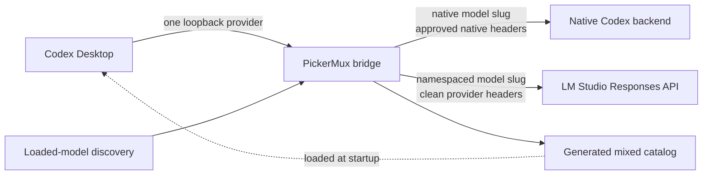

# PickerMux

[](https://github.com/patrickschiller/pickermux/actions/workflows/ci.yml)
[](LICENSE)
[](#requirements)
[](#requirements)

**Use local LM Studio models directly from the Codex Desktop picker.**

PickerMux makes local models feel like a first-class part of Codex Desktop. Load
a model in LM Studio, refresh PickerMux, and select it from the same familiar
model picker—without maintaining separate Codex profiles, repeatedly editing
providers, or switching to a separate local-only workflow.

Your existing Codex models remain in place while PickerMux adds clear,
namespaced entries for the local models that are actually loaded. The result is
a fast local-model workflow with accurate context information, model-specific
reasoning levels, and a strict routing boundary between native and external
providers.


*Load models in LM Studio, refresh PickerMux, and select them directly in Codex
Desktop.*

PickerMux is an unofficial community project. It is not affiliated with,
endorsed by, or supported by OpenAI, Codex, or LM Studio.

## Why PickerMux

Running a model in LM Studio is straightforward. Using it repeatedly inside
Codex Desktop is where friction usually starts: provider changes, model IDs,
context settings, and separate launch modes interrupt the flow.

PickerMux turns that setup into a short, repeatable workflow while staying
deliberately conservative:

- **Load, refresh, select.** Models currently loaded in LM Studio are discovered
  and added to the normal Codex Desktop picker.
- **One familiar interface.** Move between local models without maintaining a
  collection of Codex profiles or editing configuration for every switch.
- **No fake capabilities.** Context size and reasoning options come from the
  loaded LM Studio instance. PickerMux never inflates a model's context window.
- **Safe model defaults.** Newly discovered external models start in text-only
  mode. Tool access is enabled only after that exact model and configuration
  pass a live certification matrix.
- **Credential isolation.** Native Codex authentication and metadata are never
  forwarded to LM Studio or another external provider.
- **Transactional lifecycle.** Install, refresh, rollback, diagnostics, and
  uninstall are designed as one managed workflow rather than a collection of
  manual edits to `~/.codex`.
- **Small supply-chain surface.** The runtime has no third-party npm
  dependencies.

## How it works

PickerMux uses Codex's documented custom-provider configuration and the
[`model_catalog_json`](https://learn.chatgpt.com/docs/config-file/config-reference#configtoml)
catalog loaded at application startup.



The bridge listens only on `127.0.0.1` behind a randomly generated capability
path. Native model slugs remain on the native Codex route. External model slugs
are namespaced, resolved through an immutable provider registry, and sent with
a newly constructed header set.

See [Architecture](docs/ARCHITECTURE.md) for the complete trust boundary,
catalog lifecycle, request normalization, and certification design.

## Requirements

- macOS;
- Codex Desktop installed and signed in;
- LM Studio with its local server enabled and at least one LLM loaded;
- Node.js 22.15.0 or newer with native Zstandard support;
- a current account model cache created by the installed Codex Desktop build.

PickerMux is macOS-specific because it uses LaunchAgents, LaunchServices, and
the macOS Keychain.

## Quick start

First, open Codex Desktop once while signed in, then fully quit it. In LM Studio,
start the local server and load the model or models you want to expose.

```bash
git clone https://github.com/patrickschiller/pickermux.git
cd pickermux

npm run verify
./bin/pickermux.mjs discover
./bin/pickermux.mjs install
```

Reopen Codex Desktop after the installation. The mixed catalog is loaded only
at process startup, so a window close is not enough: use **Codex > Quit Codex**
or press `Command-Q` before reopening it.

The included configuration expects LM Studio at
`http://127.0.0.1:1234/v1`. To use a trusted remote Mac over Tailscale or to add
another Responses-compatible provider, see [Configuration](docs/CONFIGURATION.md).

## Commands

| Command | Purpose |
| --- | --- |
| `pickermux discover` | List external models that are safe to publish from the current provider state. |
| `pickermux build` | Build and validate a mixed catalog without installing it. |
| `pickermux install` | Install the catalog, managed Codex configuration, and per-user bridge service. |
| `pickermux refresh` | Rediscover models and atomically refresh the catalog and runtime. |
| `pickermux status` | Show managed configuration, service, and compatibility status. |
| `pickermux doctor` | Run deterministic installation and routing checks. |
| `pickermux doctor --live` | Add a real LM Studio inference check. |
| `pickermux certify --model SLUG` | Run the live tool-use matrix for one external model. |
| `pickermux certify --all` | Certify every external model currently discovered. |
| `pickermux credential-set PROVIDER` | Store a provider credential interactively in the macOS Keychain. |
| `pickermux credential-status PROVIDER` | Report only whether a provider credential is available. |
| `pickermux credential-delete PROVIDER` | Delete the named provider's Keychain item. |
| `pickermux uninstall` | Restore the previous Codex configuration and remove managed runtime files. |

Run `pickermux help`, `pickermux --help`, or `pickermux -h` for the compact CLI
reference. `bin/lmstudio-picker.mjs` remains available as a compatibility alias.

When running directly from a clone, replace `pickermux` with
`./bin/pickermux.mjs` as shown in the quick start.

## Model discovery

The default `loaded` mode reads LM Studio's `/api/v1/models` metadata and
publishes only models that are currently loaded as LLMs. Embedding models,
unloaded models, invalid identifiers, foreign namespaces, and models without a
confirmed loaded context size are excluded.

For multiple loaded instances of the same model, PickerMux uses the smallest
reported context window. Models below 32,768 tokens receive a visible warning
marker in the picker, but their real context value remains unchanged.

If LM Studio is intentionally stopped, PickerMux publishes a native-only
catalog the next time synchronization is allowed. If the selected local model
disappears, the managed selection returns to the configured native fallback.
Transient discovery failures keep the last known good catalog instead of
silently erasing models.

## Tool certification

Every new external model starts conservatively with no Codex tool surface. A
live certification run verifies text, streaming, direct functions,
parameterless functions, namespaced functions, tool results, and long-context
behavior. A pass receipt is bound to the provider, model, context, capability
metadata, and Codex client version.

```bash
./bin/pickermux.mjs certify --model lmstudio/qwen/qwen3.8-27b
```

If any bound property changes, the receipt becomes stale and the model falls
back to text-only mode. Certification sends real prompts to the selected model;
do not run it in parallel with an active local-model turn.

## Security model

PickerMux treats the bridge as a security boundary, not just a convenience
proxy.

- It never reads `~/.codex/auth.json`.
- ChatGPT tokens, cookies, account identifiers, attestation data, and Codex
  metadata are stripped before every external request.
- Native credentials are forwarded only for exact native model routes.
- External requests receive a fresh allowlisted header set.
- Provider secrets can be stored under provider-specific macOS Keychain items;
  they are never written to project configuration or status output.
- Inline secrets, URL credentials, wildcard model lists, unapproved private
  network targets, path traversal, and unsafe configuration ownership fail
  closed.
- Configuration changes, catalogs, compatibility data, service files, and
  rollback state are written privately and transactionally.

Read [SECURITY.md](SECURITY.md) before reporting a vulnerability or sharing
diagnostic output.

## After Codex or LM Studio updates

Run:

```bash
./bin/pickermux.mjs status
./bin/pickermux.mjs doctor
```

If compatibility is reported as `update-required`, refresh the project and
installed runtime before continuing. If the Codex account cache no longer
matches the installed client, uninstall PickerMux, launch and fully quit Codex
once without the override, then install PickerMux again. This lets Codex refresh
its own account-visible catalog first.

See [Troubleshooting](docs/TROUBLESHOOTING.md) for recovery procedures and
redaction guidance.

## Current scope and limitations

- PickerMux currently supports macOS only.
- Picker catalog changes require a full Codex Desktop restart; there is no
  supported live catalog reload.
- Access-controlled native models appear only when the authenticated account
  is entitled to them.
- Local quality, tool reliability, and latency depend on the selected model,
  quantization, context size, hardware, and LM Studio configuration.
- `doctor --live` and certification perform real local inference and can take
  several minutes on large models.
- Codex and LM Studio updates can change compatibility. The bridge intentionally
  stops when its installed contract is no longer verified.

## Development

```bash
npm test
npm run check
npm run verify
```

The v0.4.0 publication baseline contains 203 automated tests across catalog
construction, routing, credential isolation, lifecycle rollback, discovery,
tool normalization, and compatibility handling. CI runs on macOS with Node.js
22.15, 24, and 26.

Contributions are welcome. Start with [CONTRIBUTING.md](CONTRIBUTING.md), follow
the [Code of Conduct](CODE_OF_CONDUCT.md), and use [SUPPORT.md](SUPPORT.md) to
choose the right support channel.

## License

PickerMux is released under the [MIT License](LICENSE).

OpenAI, Codex, ChatGPT, LM Studio, and all other product names are trademarks of
their respective owners. Their use here is descriptive and does not imply
affiliation or endorsement.
