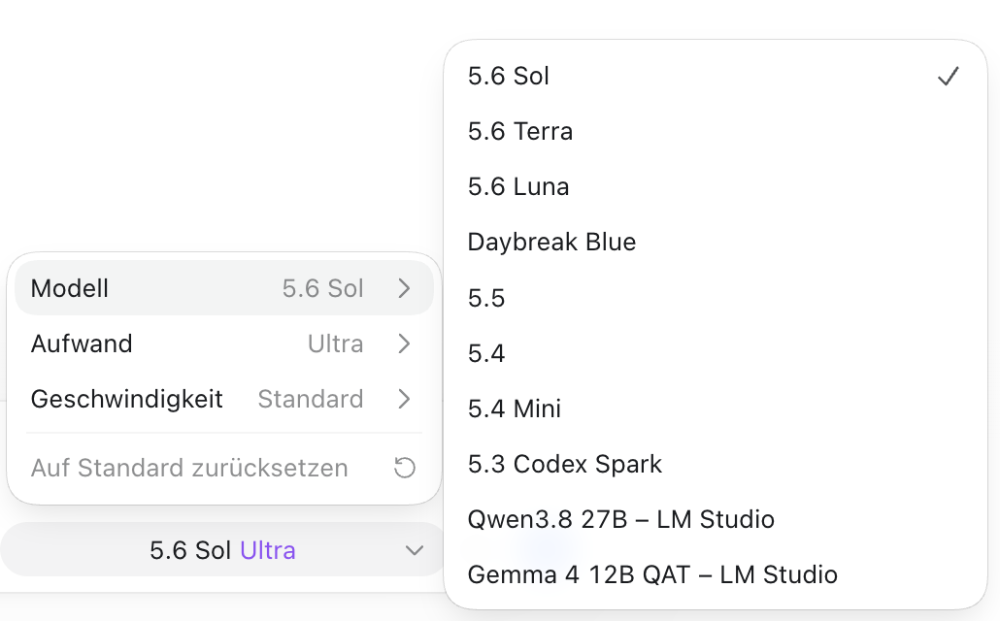
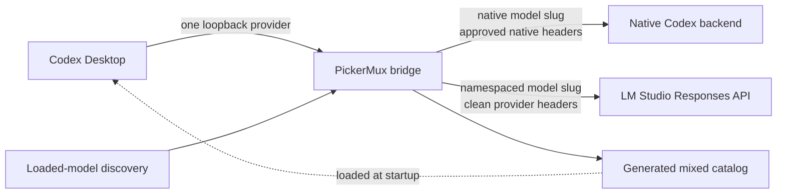

# PickerMux

[](https://github.com/patrickschiller/pickermux/actions/workflows/ci.yml)
[](LICENSE)
[](#requirements)
[](#requirements)

**Use local LM Studio models directly from the Codex Desktop picker.**

PickerMux makes local models feel like a first-class part of Codex Desktop. Load
a model in LM Studio, refresh PickerMux, and select it from the same familiar
model picker—without maintaining separate Codex profiles, repeatedly editing
providers, or switching to a separate local-only workflow.

Your existing Codex models remain in place while PickerMux adds clear,
namespaced entries for the local models that are actually loaded. The result is
a fast local-model workflow with accurate context information, model-specific
reasoning levels, and a strict routing boundary between native and external
providers.



*Load models in LM Studio, refresh PickerMux, and select them directly in Codex
Desktop.*

PickerMux is an unofficial community project. It is not affiliated with,
endorsed by, or supported by OpenAI, Codex, or LM Studio.

## Requirements

- macOS on Apple silicon or Intel;
- Codex Desktop installed, opened once while signed in, and then fully quit;
- LM Studio with its local server enabled and at least one LLM loaded;
- Node.js 22.15.0 or newer with native Zstandard support;
- a current account model cache created by the installed Codex Desktop build.

PickerMux is macOS-specific because it uses LaunchAgents, LaunchServices, and
the macOS Keychain. The installer runs entirely as the current user: it neither
uses `sudo` nor edits shell startup files.

## Install

After satisfying the requirements above, install the latest release with one
command:

```bash
/usr/bin/curl --proto '=https' --proto-redir '=https' --tlsv1.2 -fsSL https://github.com/patrickschiller/pickermux/releases/latest/download/install.sh | /bin/sh
```

The release installer downloads an exact versioned archive, verifies its
embedded SHA-256 digest, rejects unsafe archive entries, and then hands off to
PickerMux's transactional setup lifecycle. It stores versioned CLI files below
`~/Library/Application Support/PickerMux` and exposes the command as
`~/.local/bin/pickermux`.

If `~/.local/bin` is not already in `PATH`, the installer prints the exact
one-time shell configuration needed. It does not change `.zprofile`, `.zshrc`,
or another shell file automatically. Until then, use the absolute command path.

For a reproducible installation, replace `latest` with an exact release:

```bash
/usr/bin/curl --proto '=https' --proto-redir '=https' --tlsv1.2 -fsSL https://github.com/patrickschiller/pickermux/releases/download/v0.5.0/install.sh | /bin/sh
```

Both one-line forms execute code downloaded from GitHub. The archive checksum
protects against corruption or asset substitution after the installer starts,
but the bootstrap still trusts HTTPS, GitHub, and the maintainer account. To
review it first, download `install.sh`, inspect it locally, and execute the saved
file only after you are satisfied.

Reopen Codex Desktop after setup. The mixed catalog is loaded only at process
startup, so closing a window is not enough: use **Codex > Quit Codex** or press
`Command-Q` before reopening it.

The included configuration expects LM Studio at
`http://127.0.0.1:1234/v1`. To use a trusted remote Mac over Tailscale or add
another Responses-compatible provider, create the custom configuration first
and follow the managed setup procedure in
[Configuration](docs/CONFIGURATION.md).

## Verify the installation

```bash
pickermux --version
pickermux status
pickermux doctor
```

`doctor` is deterministic and does not submit a model prompt. Its independent
`codex-account-cache` check reports whether the signed-in account cache matches
the installed Codex client even when the bridge runtime or mixed catalog is
absent. Use `pickermux doctor --live` only when you intentionally want a real
LM Studio inference check.

## Daily workflow

1. Start the LM Studio server and load the LLMs you want to expose.
2. Run `pickermux refresh`.
3. Fully quit and reopen Codex Desktop.
4. Select the namespaced LM Studio model from the normal Codex model picker.

## Upgrade and uninstall

PickerMux never updates silently. Run the same latest-release installer again
to stage and activate a newer version. A healthy installation is refreshed
transactionally; failed activation restores the previous CLI and bridge state.
The same version is safe to run again, while an implicit downgrade is refused.
Setup checks the account-scoped Codex model cache before staging, repeats the
check under the lifecycle lock, and checks it again immediately before
activation. A missing or client-version-mismatched cache leaves the active
installation unchanged. Fully quit Codex Desktop with `Command-Q` before
running setup or any uninstall mode.

Remove only the Codex integration, LaunchAgent, and managed runtime with:

```bash
pickermux uninstall
```

To remove the integration and the receipt-owned CLI distribution as well, use:

```bash
pickermux uninstall --remove-cli
```

Verified configuration backups and provider credentials in the macOS Keychain
are deliberately retained in both cases. PickerMux never removes unrecognized
launcher files or distribution paths.

For an explicit full removal, including verified PickerMux backups and every
PickerMux provider credential identified by its private, secret-free provider
registry, use:

```bash
pickermux uninstall --purge
```

`--purge` implies `--remove-cli`. Runtime, CLI, backup, and registry state is
inventoried and revalidated using installation receipts, SHA-256 hashes, and
device/inode identity before exact entries are removed. State observed as
modified, foreign, ambiguous, or concurrently replaced fails closed and remains
available for review; PickerMux does not recursively delete an untrusted
directory. Ownership-sensitive cache, configuration, receipt, runtime, backup,
and registry files are rejected before payload reads when they are symbolic or
multiply linked. The same-user final-syscall race boundary is documented in
[SECURITY.md](SECURITY.md), together with recovery semantics for a partial
multi-item Keychain deletion. Full purge never reads, changes, or removes
native Codex authentication, including `~/.codex/auth.json`.

## Why PickerMux

Running a model in LM Studio is straightforward. Using it repeatedly inside
Codex Desktop is where friction usually starts: provider changes, model IDs,
context settings, and separate launch modes interrupt the flow.

PickerMux turns that setup into a short, repeatable workflow while staying
deliberately conservative:

- **Load, refresh, select.** Models currently loaded in LM Studio are discovered
  and added to the normal Codex Desktop picker.
- **One familiar interface.** Move between local models without maintaining a
  collection of Codex profiles or editing configuration for every switch.
- **No fake capabilities.** Context size and reasoning options come from the
  loaded LM Studio instance. PickerMux never inflates a model's context window.
- **Safe model defaults.** Newly discovered external models start in text-only
  mode. LM Studio models use a compact text-only prompt. The bridge removes
  optional tool schemas and only Codex bootstrap blocks whose annotation,
  message role, and single envelope exactly match the verified contract, then
  rejects forced tool turns until that exact model and configuration pass a
  live certification matrix. User messages, attachments, project instructions,
  memory, and conversation history remain intact.
- **Credential isolation.** Native Codex authentication and metadata are never
  forwarded to LM Studio or another external provider, including Codex client
  metadata carried inside a Responses request body.
- **Transactional lifecycle.** Install, refresh, rollback, diagnostics, and
  uninstall are designed as one managed workflow rather than a collection of
  manual edits to `~/.codex`.
- **Small supply-chain surface.** The runtime has no third-party npm
  dependencies.

## How it works

PickerMux uses Codex's documented custom-provider configuration and the
[`model_catalog_json`](https://learn.chatgpt.com/docs/config-file/config-reference#configtoml)
catalog loaded at application startup.



The bridge listens only on `127.0.0.1` behind a randomly generated capability
path. Native model slugs remain on the native Codex route. External model slugs
are namespaced, resolved through an immutable provider registry, and sent with
a newly constructed header set.

See [Architecture](docs/ARCHITECTURE.md) for the complete trust boundary,
catalog lifecycle, request normalization, and certification design.

## Commands

| Command | Purpose |
| --- | --- |
| `pickermux --version` | Print the exact PickerMux release version. |
| `pickermux setup [--config PATH]` | Install a fresh release or transactionally activate it over a healthy installation. |
| `pickermux discover` | List external models that are safe to publish from the current provider state. |
| `pickermux build` | Build and validate a mixed catalog without installing it. |
| `pickermux install` | Install the catalog, managed Codex configuration, and per-user bridge service. |
| `pickermux refresh` | Rediscover models and atomically refresh the catalog and runtime. |
| `pickermux status` | Show managed configuration, service, and compatibility status. |
| `pickermux doctor` | Run deterministic installation and routing checks. |
| `pickermux doctor --live` | Add a real LM Studio inference check. |
| `pickermux certify --model SLUG` | Run the live tool-use matrix for one external model. |
| `pickermux certify --all` | Certify every external model currently discovered. |
| `pickermux credential-set PROVIDER` | Store a provider credential interactively in the macOS Keychain. |
| `pickermux credential-status PROVIDER` | Report only whether a provider credential is available. |
| `pickermux credential-delete PROVIDER` | Delete the named provider's Keychain item. |
| `pickermux uninstall` | Restore the previous Codex configuration and remove managed runtime files. |
| `pickermux uninstall --remove-cli` | Also remove only the receipt-owned CLI launcher and versioned distribution. |
| `pickermux uninstall --purge` | Fully remove the integration, receipt-owned CLI, verified backups, and registered provider Keychain credentials. |

Run `pickermux help`, `pickermux --help`, or `pickermux -h` for the compact CLI
reference. `bin/lmstudio-picker.mjs` remains available as a compatibility alias.

When running directly from a development clone, replace `pickermux` with
`./bin/pickermux.mjs`.

## Model discovery

The default `loaded` mode reads LM Studio's `/api/v1/models` metadata and
publishes only models that are currently loaded as LLMs. Embedding models,
unloaded models, invalid identifiers, foreign namespaces, and models without a
confirmed loaded context size are excluded.

For multiple loaded instances of the same model, PickerMux uses the smallest
reported context window. Models below 32,768 tokens receive a visible warning
marker in the picker, but their real context value remains unchanged.

If LM Studio is intentionally stopped, PickerMux publishes a native-only
catalog the next time synchronization is allowed. If the selected local model
disappears, the managed selection returns to the configured native fallback.
Transient discovery failures keep the last known good catalog instead of
silently erasing models.

## Tool certification

Every new external model starts conservatively with no Codex tool surface. A
live certification run verifies text, streaming, direct functions,
parameterless functions, namespaced functions, tool results, and long-context
behavior. A pass receipt is bound to the provider, model, context, capability
metadata, and Codex client version.

```bash
pickermux certify --model lmstudio/qwen/qwen3.8-27b
```

If any bound property changes, the receipt becomes stale and the model falls
back to text-only mode. Certification sends real prompts to the selected model;
do not run it in parallel with an active local-model turn.

## Security model

PickerMux treats the bridge as a security boundary, not just a convenience
proxy.

- It never reads `~/.codex/auth.json`.
- ChatGPT tokens, cookies, account identifiers, attestation data, and Codex
  metadata are stripped before every external request.
- Native credentials are forwarded only for exact native model routes.
- External requests receive a fresh allowlisted header set.
- Uncertified external routes are transport-enforced as text-only even if the
  client submits function schemas; the private certification marker is never
  forwarded upstream.
- Provider secrets can be stored under provider-specific macOS Keychain items;
  they are never written to project configuration or status output.
- Inline secrets, URL credentials, wildcard model lists, unapproved private
  network targets, path traversal, and unsafe configuration ownership fail
  closed.
- Configuration changes, catalogs, compatibility data, service files, and
  rollback state are written privately and transactionally.
- Release payloads are versioned, checksum-verified, and extracted only after
  unsafe paths and file types have been rejected.
- Uninstall inventories and revalidates exact owned paths before removal. Full
  purge refuses modified or foreign runtime, distribution, backup, and
  provider-registry state instead of deleting it recursively.

Read [SECURITY.md](SECURITY.md) before reporting a vulnerability or sharing
diagnostic output.

## After Codex or LM Studio updates

Run:

```bash
pickermux status
pickermux doctor
```

If compatibility is reported as `update-required`, rerun the latest-release
installer. Setup performs the cache check at all three activation barriers and
does not change active PickerMux state when the cache still belongs to an older
Codex version. Follow the printed recovery steps: if PickerMux is installed,
run `pickermux uninstall`; then launch Codex while signed in, wait for its
native picker to load, fully quit with `Command-Q`, and rerun setup with the
same custom configuration, if one was used. Do not delete `models_cache.json`
or `~/.codex/auth.json` as a workaround.

See [Troubleshooting](docs/TROUBLESHOOTING.md) for recovery procedures and
redaction guidance.

## Current scope and limitations

- PickerMux currently supports macOS only.
- Picker catalog changes require a full Codex Desktop restart; there is no
  supported live catalog reload.
- Access-controlled native models appear only when the authenticated account
  is entitled to them.
- Local quality, tool reliability, and latency depend on the selected model,
  quantization, context size, hardware, and LM Studio configuration.
- `doctor --live` and certification perform real local inference and can take
  several minutes on large models.
- Codex and LM Studio updates can change compatibility. The bridge intentionally
  stops when its installed contract is no longer verified.

## Development

For an auditable development installation from a clone:

```bash
git clone https://github.com/patrickschiller/pickermux.git
cd pickermux
npm run verify
./bin/pickermux.mjs discover
./bin/pickermux.mjs install
```

The clone remains the source for these direct commands; use the release
installer for the managed, versioned end-user CLI.

```bash
npm test
npm run check
npm run verify
```

Automated coverage includes catalog construction, routing, credential
isolation, lifecycle rollback, release packaging, installer failures,
discovery, tool normalization, and compatibility handling. CI runs on macOS
with Node.js 22.15, 24, and 26.

Contributions are welcome. Start with [CONTRIBUTING.md](CONTRIBUTING.md), follow
the [Code of Conduct](CODE_OF_CONDUCT.md), and use [SUPPORT.md](SUPPORT.md) to
choose the right support channel.

## License

PickerMux is released under the [MIT License](LICENSE).

OpenAI, Codex, ChatGPT, LM Studio, and all other product names are trademarks of
their respective owners. Their use here is descriptive and does not imply
affiliation or endorsement.
