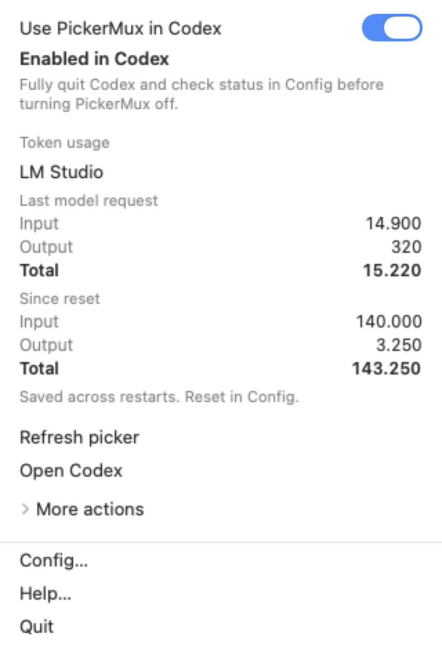
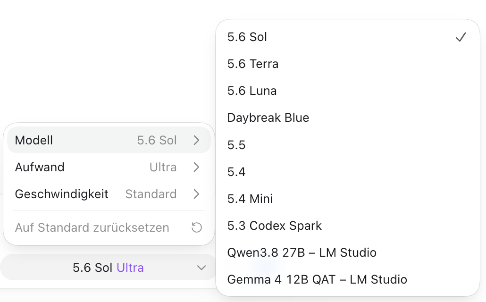

# PickerMux

**Local and remote models in Codex Desktop, controlled from your menu bar.**

PickerMux adds models from compatible Responses providers to the familiar
Codex model picker, alongside the native models available to your account.
Its macOS app installs the integration with one switch, refreshes the picker,
and guides recovery after a Codex update. LM Studio is the default provider;
other local or remote Responses providers use a custom configuration.

**[Download PickerMux for macOS](https://github.com/patrickschiller/pickermux/releases/latest/download/PickerMux-macos-universal.dmg)**
— one universal DMG for Apple silicon and Intel.

<table>
  <tr>
    <td width="50%" align="center"><strong>Menu-bar companion</strong></td>
    <td width="50%" align="center"><strong>Codex model picker</strong></td>
  </tr>
  <tr>
    <td valign="top"></td>
    <td valign="top"></td>
  </tr>
</table>

*Left: app UI preview with demo status. Right: Codex picker screenshot.*

PickerMux is an unofficial community project. It is not affiliated with,
endorsed by, or supported by OpenAI, Codex, or LM Studio.

## Requirements

- macOS 13 or newer, on Apple silicon or Intel.
- Codex Desktop, opened once while signed in so its native model picker loads.
- Node.js 22.15.0 or newer in `/opt/homebrew/bin`, `/usr/local/bin`, or `/usr/bin`.
  Node.js is not bundled; [download Node.js](https://nodejs.org/en/download).
- A compatible Responses provider with an available model. For the default
  LM Studio setup, start its server and load at least one LLM.

Chat Completions compatibility alone is insufficient. See
[provider configuration](docs/CONFIGURATION.md#supported-provider-kinds) for
custom endpoints, model allowlists, and provider credentials.

## Install

1. Download the DMG, open it, and drag **PickerMux.app** to **Applications**.
2. Eject the disk image and open PickerMux from Applications.
3. Fully quit Codex with **Command-Q** and keep your provider models available.
4. Turn on **Use PickerMux in Codex** in the menu-bar panel.
5. Wait for setup to finish, then reopen Codex and select a provider model.

Turning the switch on authorizes installation and live model-certification
prompts. Allow several minutes per model; keep Codex closed until setup ends.
Only models that pass their exact certification receive tool access. Copying
the app alone does not change Codex or install the integration.

For upgrades, download the new DMG, quit PickerMux, and replace its app. The
new app offers a reviewed backend upgrade while Codex is closed, preserving
your installed provider configuration. See
[upgrade details](docs/TECHNICAL_GUIDE.md#installation-and-upgrades).

## Everyday use

Make your provider models available, fully quit Codex, choose **Refresh picker**,
and reopen Codex. With LM Studio, load the models you want before refreshing.
Newly discovered models need **Certify models…** before they can use tools.

**Check status** inspects the installation. **Settings…** contains update checks,
optional login startup, refresh after Codex closes, and notifications. After a
Codex update, **Repair after a Codex update…** explains the recovery and asks
before quitting and reopening Codex. Catalog changes require a full restart.

The panel's **Token usage** section shows input, output, and total tokens per
external provider for the last model request and since the bridge started.
It uses provider-reported counts from requests through PickerMux, including
tool rounds and context summaries. Missing counts are marked unavailable;
partial sums are labelled. See [token usage](docs/MACOS_COMPANION.md#token-usage).

## Switch off or remove

Turning **Use PickerMux in Codex** off restores the native picker while retaining
PickerMux for later use. Fully quit and reopen Codex to load that change.

For complete removal, quit Codex and choose **Settings → Remove PickerMux
completely…**. Confirm removal of the integration, CLI, managed data, verified
backups, and registered provider credentials. Then quit PickerMux and move its
app to the Trash. Codex sign-in, projects, chats, and unrelated settings stay
intact. An inactive provider alias keeps historical chats readable; choose a
native model before continuing one. [Removal details](docs/TECHNICAL_GUIDE.md#deactivation-and-removal).

## Technical overview

- A private loopback bridge routes each exact model to its provider.
- External requests receive only their provider's credentials; native Codex
  credentials and metadata remain isolated.
- Tool capabilities are certified for each model and configuration.
- LM Studio supports loaded-model discovery, deferred tool schemas, and local
  context compaction; other Responses providers use explicit model allowlists.
- Install, refresh, recovery, and removal use verified ownership and rollback.
- The SwiftUI app bundles the Node.js backend, with no third-party runtime npm
  dependencies. Node.js remains an external prerequisite.

Read the [technical guide](docs/TECHNICAL_GUIDE.md) for CLI commands, certification,
performance, recovery, and limitations. Detailed references:
[architecture](docs/ARCHITECTURE.md), [configuration](docs/CONFIGURATION.md),
[companion app](docs/MACOS_COMPANION.md), and [security](SECURITY.md).

## Help and contribute

Start with [troubleshooting](docs/TROUBLESHOOTING.md) or [support](SUPPORT.md).
Contributors should read [CONTRIBUTING.md](CONTRIBUTING.md) and the
[Code of Conduct](CODE_OF_CONDUCT.md). PickerMux is released under the
[MIT License](LICENSE).
