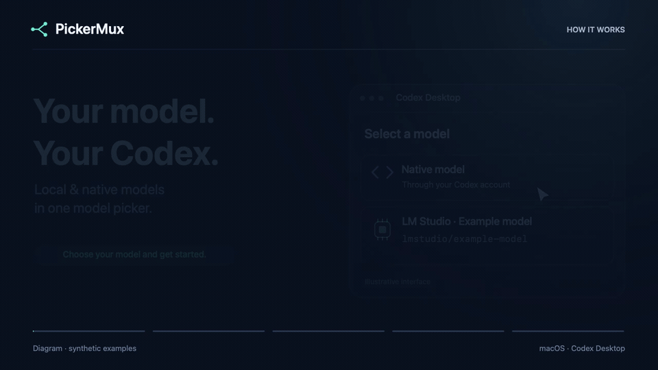

# PickerMux

**Local and remote models in Codex Desktop, controlled from your menu bar.**

PickerMux adds models from compatible Responses providers to the familiar
Codex model picker, alongside the native models available to your account.
Its macOS app installs the integration with one switch, refreshes the picker,
and guides recovery after a Codex update. LM Studio is the default provider;
other local or remote Responses providers use a custom configuration.
An experimental Kolibri MLX configuration adds one pinned local model through
a dedicated text-only Chat Completions adapter.

**[Download PickerMux for macOS](https://github.com/patrickschiller/pickermux/releases/latest/download/PickerMux-macos-universal.dmg)**
— one universal DMG for Apple silicon and Intel.

<table>
  <tr>
    <td width="50%" align="center"><strong>Menu-bar companion</strong></td>
    <td width="50%" align="center"><strong>Codex model picker</strong></td>
  </tr>
  <tr>
    <td valign="top"></td>
    <td valign="top"></td>
  </tr>
</table>

*Left: synthetic compact-menu preview with example usage. Right: Codex picker screenshot.*

**See how PickerMux works — 36 seconds, English, no audio.**

*Synthetic examples explain the model and tool request paths.*
[Download the MP4](assets/demo/pickermux-explainer-en.mp4) ·
[Media details and renderer](assets/demo/README.md)

PickerMux is an unofficial community project. It is not affiliated with,
endorsed by, or supported by OpenAI, Codex, or LM Studio.

## Requirements

- macOS 13 or newer, on Apple silicon or Intel.
- Codex Desktop, opened once while signed in so its native model picker loads.
- Node.js 22.15.0 or newer in `/opt/homebrew/bin`, `/usr/local/bin`, or `/usr/bin`.
  Node.js is not bundled; [download Node.js](https://nodejs.org/en/download).
- A compatible Responses provider with an available model. For the default
  LM Studio setup, start its server and load at least one LLM.

Chat Completions compatibility alone is insufficient. See
[provider configuration](docs/CONFIGURATION.md#supported-provider-kinds) for
custom endpoints, model allowlists, and provider credentials.
The explicit `mlx-chat-completions` exception supports the reviewed Kolibri
launcher on Apple silicon; it does not provide general Chat Completions support.

## Install

1. Download the DMG, open it, and drag **PickerMux.app** to **Applications**.
2. Eject the disk image and open PickerMux from Applications.
3. Fully quit Codex with **Command-Q** and keep your provider models available.
4. Turn on **Use PickerMux in Codex** in the menu-bar panel.
5. Wait for setup to finish, then reopen Codex and select a provider model.

Turning the switch on authorizes installation and live model-certification
prompts. Allow several minutes per model; keep Codex closed until setup ends.
Only models that pass their exact certification receive tool access. Copying
the app alone does not change Codex or install the integration.

For upgrades, download the new DMG, quit PickerMux, and replace its app. App
and installed backend versions are separate. PickerMux 0.22.2 shows the
version difference and automatically presents the backend upgrade review
when an active, verified installation is ready and Codex is fully closed.
Confirm once to update the backend while preserving your provider
configuration. **Settings → Update installed backend…** remains available
for a manual retry and is the upgrade path in 0.22.1. See
[upgrade details](docs/TECHNICAL_GUIDE.md#installation-and-upgrades).

## Everyday use

Make your provider models available, fully quit Codex, choose **Refresh picker**,
and reopen Codex. With LM Studio, load the models you want before refreshing.
Newly discovered models need **Certify models…** before they can use tools.

The compact menu offers **Refresh picker**, **Open Codex**, **Check status**, and
**Check installation** as full-width rows, with specific feedback below them.
**Settings…**, **Help…**, and **Quit** appear as separate rows at the bottom.
**Settings…** contains update checks,
optional login startup, refresh after Codex closes, and notifications. After a
Codex update, **Repair after a Codex update…** explains the recovery and asks
before quitting and reopening Codex. Catalog changes require a full restart.

If a working installation suddenly shows **Integration needs review**, review
the [configuration-conflict checks](docs/TROUBLESHOOTING.md#integration-needs-review-after-an-unrelated-codex-setting-change).
A Codex `service_tier` setting inside PickerMux's marked root block can trigger
that message in 0.20.1 and earlier without a manual configuration edit; the
0.22.0 backend recognizes and preserves that setting after receipt verification.

The panel's **Token usage** section shows input, output, and total tokens per
external provider in stacked **Last model request** and **Since reset** blocks.
It uses provider-reported counts from requests through PickerMux, including
tool rounds and context summaries. Missing counts are marked unavailable;
partial sums are labelled. Counts and the last request survive bridge restarts,
refreshes, and backend upgrades. **Settings → Token usage → Reset accumulated
counts…** clears accumulated counts while retaining the last request.
See [token usage](docs/MACOS_COMPANION.md#token-usage).

## Voice with a local model

PickerMux 0.22.0 adds experimental GPT-Live WebRTC support. Codex can
use OpenAI for voice while the selected local model handles delegated tasks.
Voice audio and conversation context go to OpenAI, including when a local model
is selected. This requires native sign-in and account access to Codex voice;
local tool access still requires exact model certification. Voice and local
delegation require manual validation with the installed backend and compatible
client. See [voice setup and acceptance](docs/TECHNICAL_GUIDE.md#gpt-live-voice-and-local-tasks).

## Kolibri on Apple silicon

The source checkout includes [kolibri-picker.config.json](kolibri-picker.config.json)
and a launcher for the immutable `velaia/Kolibri-1-MLX-4bit` snapshot. Use an
isolated Python runtime with the exact [dependency pins](scripts/kolibri-requirements.txt).
The model download is about 41 GiB and the conversion targets Macs with at least
64 GB of unified memory.

Kolibri appears as **Kolibri 1 MLX 4-bit** alongside the native models. This
initial integration supports text replies and streamed text with reasoning
disabled. Tools, shell access, images, audio, certification and context
compaction are unavailable. The launcher enforces an 8,192-token combined
prompt/output limit; an oversized conversation is rejected without dropping
history. See [setup and limitations](docs/CONFIGURATION.md#kolibri-mlx-text-provider).

## Switch off or remove

Turning **Use PickerMux in Codex** off restores the native picker while retaining
PickerMux for later use. Fully quit and reopen Codex to load that change.

For complete removal, quit Codex and choose **Settings → Remove PickerMux
completely…**. Confirm removal of the integration, CLI, managed data, verified
backups, and registered provider credentials. Then quit PickerMux and move its
app to the Trash. Codex sign-in, projects, chats, and unrelated settings stay
intact. An inactive provider alias keeps historical chats readable. If an old
chat keeps reconnecting with a native model selected, its saved provider may
still need [native-provider recovery](docs/TROUBLESHOOTING.md#reconnecting-in-an-old-chat-after-deactivation-or-uninstall).
See [removal details](docs/TECHNICAL_GUIDE.md#deactivation-and-removal).

## Technical overview

- A private loopback bridge routes each exact model to its provider.
- External requests receive only their provider's credentials; native Codex
  credentials and metadata remain isolated.
- Tool capabilities are certified for each model and configuration.
- LM Studio supports loaded-model discovery, deferred tool schemas, and local
  context compaction; other Responses providers use explicit model allowlists.
- The experimental Kolibri MLX adapter translates only reviewed text requests
  and replies and verifies its context limit against the dedicated launcher.
- Tool descriptions explain how LM Studio's translated web tool opens source
  URLs and how to discover missing tools; factual accuracy depends on the model.
- Install, refresh, recovery, and removal use verified ownership and rollback.
- The SwiftUI app bundles the Node.js backend, with no third-party runtime npm
  dependencies. Node.js remains an external prerequisite.

Read the [technical guide](docs/TECHNICAL_GUIDE.md) for CLI commands, certification,
performance, recovery, and limitations. Detailed references:
[architecture](docs/ARCHITECTURE.md), [configuration](docs/CONFIGURATION.md),
[companion app](docs/MACOS_COMPANION.md), and [security](SECURITY.md).

## Help and contribute

Start with [troubleshooting](docs/TROUBLESHOOTING.md) or [support](SUPPORT.md).
Contributors should read [CONTRIBUTING.md](CONTRIBUTING.md) and the
[Code of Conduct](CODE_OF_CONDUCT.md). PickerMux is released under the
[MIT License](LICENSE).
