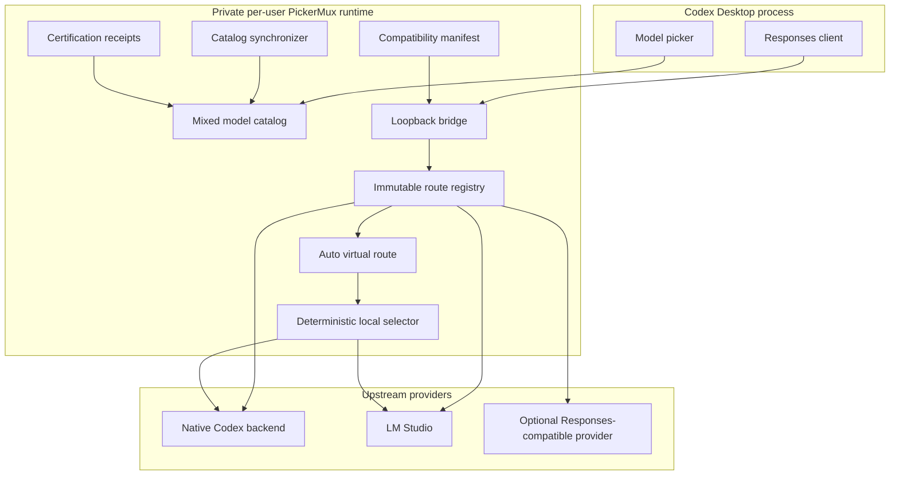

# PickerMux Architecture

This document describes the current public bridge contract. It is intended for
contributors, security reviewers, and users who want to understand what runs on
their Mac.

## Design goals

PickerMux is designed around six invariants:

1. Native Codex models and external models share a picker, not a trust domain.
2. A model slug must resolve to exactly one immutable route.
3. Native credentials and metadata must never reach an external provider.
4. External capabilities must be measured rather than assumed.
5. Installation and refresh must either complete fully or restore the previous
   working state.
6. A virtual Auto route must resolve to one concrete route before credential
   lookup, DNS resolution, or upstream network activity.

## Components



The service is installed as a user LaunchAgent. Its runtime copy lives outside
the source checkout so macOS privacy protection on folders such as Documents
does not break login-time startup.

## Catalog construction

PickerMux builds the catalog in the following order:

1. Read the bundled catalog from the installed Codex client as a schema donor.
2. Read the authenticated account snapshot from `models_cache.json`.
3. Require the account snapshot to match the installed Codex client version for
   `install` and `refresh`.
4. Discover external provider models under the configured policy.
5. When smart routing is enabled, clone the exact configured account-visible
   native fallback record to construct the synthetic Auto record.
6. Build conservative external catalog records from the donor schema and
   measured provider metadata.
7. Apply valid model-specific certification receipts.
8. Assemble the final order as native models, Auto when enabled, then external
   models.
9. Validate the default selection and every expected catalog slug through the
   Codex client.
10. Atomically publish the catalog and compatibility manifest.

The account snapshot is the source of truth for native model visibility. The
bundled catalog is not used to invent account access. The preview-only `build`
command can use the bundle as a diagnostic fallback, but persistent installation
cannot.

External slugs must begin with their provider namespace, such as
`lmstudio/qwen/qwen3.8-27b`. An unknown, differently cased, or prefix-only slug
fails before an upstream request is opened.

The Auto record has the fixed slug `pickermux/auto`. Its complete schema and
client-facing capabilities come from the exact configured native fallback. A
missing fallback or slug collision fails before publication; PickerMux does not
substitute another native donor. The Auto component hash is deterministic and
binds the virtual catalog format, normalized routing configuration, fallback
identity and component hash, and `local-first-v1` strategy.

Auto uses `medium` as its default reasoning level when the donor supports it,
then `low` when available, and otherwise retains the donor default. It never
advertises a reasoning level that the native donor does not support.

## Routing boundary

The bridge binds to IPv4 loopback only. Its URL contains a high-entropy random
capability segment stored in private runtime files. Host, Origin, method, path,
query, and protocol-upgrade checks fail closed.

### Native route

For an exact native slug, PickerMux forwards only the explicitly approved
authentication, routing, tracing, content, and compression headers needed by
the native Codex request. Request bodies and server-sent events remain byte
preserving on this route.

An Auto request selected for native cannot retain its public virtual model slug.
PickerMux clones the decoded JSON body, replaces the model with the exact native
fallback, serializes plain JSON, reapplies the body-size bound, removes stale
compression metadata, and sets the exact content length. This re-encoded path
uses the same narrow native header allowlist; direct native requests continue to
use their byte-preserving path unchanged.

### External route

For an exact namespaced external slug, PickerMux discards the caller's header
set and constructs a new provider request. ChatGPT bearer tokens, cookies,
account identifiers, attestation values, and Codex metadata are not eligible for
the external header set.

Provider credentials are resolved only for the selected route. Persistent
providers can use a provider-scoped macOS Keychain item. Successful lookups are
coalesced and held in memory for no more than 30 seconds; values are not written
to logs, status output, configuration, or certification records.

### Auto virtual route

```text
Codex Desktop
      |
      | model = pickermux/auto
      v
PickerMux virtual route
      |
      v
deterministic local selector
      |
      +---- exact native fallback route
      |
      +---- exact LM Studio route
```

`pickermux/auto` is neither native nor external and has no URL, provider ID, or
credential. Its two candidates are exact immutable routes in the same registry.
Explicit native and namespaced external selections bypass the selector.

For Auto, PickerMux first validates the exact native fallback, then applies
optional in-memory affinity and checks the exact local route. Local eligibility
requires a currently available `lmstudio-responses` route, text-compatible
input, current certification when tools are exposed, no high-or-higher
reasoning request, and a conservative input estimate within both the configured
limit and 75 percent of the local context window. A bounded score over only the
latest user-authored text then keeps lower-complexity requests local or selects
the native fallback at the configured threshold.

The selector is dependency-free and performs no provider call. It selects one
concrete route before credentials, DNS, or an upstream connection. There is no
classifier request, prompt fan-out, or post-dispatch cross-provider retry. A
local timeout, refusal, HTTP error, malformed response, stream failure, or abort
is returned on that route rather than replayed against native Codex.

Affinity uses only a validated `prompt_cache_key`, hashed with SHA-256 before it
becomes a map key. The map is memory-only, limited to 256 entries, and expires
entries after 30 minutes with LRU-style recency. A native fallback affinity does
not move back to local during its lifetime. A local affinity remains local only
while all hard and scored eligibility checks pass; when it becomes ineligible,
it moves once to fallback and receives a new fallback affinity. A
`previous_response_id` without valid affinity uses fallback because provider
response identifiers may not be portable.

## LM Studio adaptation

Codex and local models do not always expose identical Responses API behavior.
The LM Studio adapter therefore performs bounded, explicit normalization:

- rewrites the public namespaced slug to the upstream LM Studio model ID;
- maps supported reasoning levels and omits only known synthetic defaults;
- removes unsupported cache and encrypted-reasoning fields;
- combines system and developer messages into one leading system block while
  preserving chronological content;
- removes unsupported optional built-in tools;
- rejects a required tool choice when normalization would make it impossible;
- maps arbitrary Codex tool namespaces to collision-resistant function names;
- restores public namespace names in JSON and streaming responses;
- normalizes empty function parameter schemas.

Request decompression supports gzip, deflate, Brotli, and Zstandard. Decoded
body size, response header size, header wait, stream idle time, and total
upstream duration are all bounded.

## Discovery and synchronization

The default LM Studio provider uses `loaded` discovery. It prefers
`/api/v1/models`, which reports loaded instances and active context sizes. A
fallback to `/v1/models` is accepted only when model type and context metadata
are explicit.

The persistent service observes Codex Desktop through LaunchServices:

- while Codex is running, endpoint discovery is paused and only local process
  state is checked;
- after Codex fully quits, synchronization begins promptly;
- while Codex remains closed, provider discovery is rate limited;
- a deliberate LM Studio connection refusal is treated as an empty loaded set;
- malformed data, timeouts, HTTP failures, and other transient errors retain the
  last known good state.

Catalog and route-registry publication is staged. If catalog publication or
selection reconciliation fails, the new route registry is not exposed.

During synchronization, PickerMux removes the existing Auto record before
extracting the native base, rebuilds Auto from normalized configuration and the
current fallback donor, then appends newly discovered external models. This
prevents duplication and prevents Auto from becoming account-visible native or
external state. If the local candidate is no longer loaded, its explicit
external record may disappear while Auto remains in the catalog and routes to
native. An existing Auto selection is retained unless smart routing is disabled
or the Auto record itself is no longer valid.

## Tool certification

New external models are published with `tool_mode = null` and shell access
disabled. Certification runs seven serial Responses requests covering eight
required gates:

- `text`;
- `stream`;
- `function`;
- `parameterless`;
- `namespaceJson`;
- `namespaceStream`;
- `toolResult`;
- `longContext`.

Before probing, PickerMux invalidates the previous receipt and publishes a
text-only catalog. An interrupted or failed run therefore cannot preserve an
old tool grant. A successful receipt is bound to the provider kind and ID, base
URL, public and upstream model IDs, active context size, reasoning metadata,
capability metadata, and Codex client version.

Receipts contain only the fingerprint, timestamp, and gate outcome. They do not
contain prompts, responses, or credentials.

Auto cannot be certified because it is a virtual route. `certify --all` operates
only on discovered external models, and direct certification of
`pickermux/auto` directs the user to certify the configured local model instead.

## Installation and rollback

The integration installer owns only marked Codex configuration fields and
explicit files under `~/.codex/model-bridge`, plus its named LaunchAgent. It
creates a verified backup before changing Codex configuration.

Install and refresh stage the runtime, catalog, compatibility manifest, service
configuration, and selection update. The previous runtime package remains
available until catalog validation, bridge restart, Codex schema checks, and
the doctor all pass. A failure restores the previous files and service state.

Setup validates the account-scoped Codex cache before staging a distribution,
repeats the same check under the installation lock before changing the active
CLI controls, and retains the catalog build's final version-bound check before
publication. A Codex update with a stale account cache therefore stops before
activation and cannot silently fall back to the bundled catalog.

Uninstall restores the verified prior Codex values and removes managed runtime
artifacts. It intentionally leaves backup directories and provider Keychain
items alone.

The release installer adds a separate, receipt-governed distribution layer.
Versioned CLI payloads live below
`~/Library/Application Support/PickerMux/versions`, an atomically replaced
`current` link selects the active payload, and `~/.local/bin/pickermux` is the
user-facing launcher. Setup never overwrites an entry or directory that cannot
be proven to belong to its private receipt.

Release activation reuses the same integration transaction: a fresh setup runs
install, while a healthy existing setup runs refresh using its installed
provider configuration. The distribution pointer is restored if activation
fails, and download, digest, or archive-validation failures occur before any
persistent mutation. Concurrent setup and removal are serialized by a private
installation lock.

Integration uninstall and distribution removal are intentionally distinct.
`uninstall` restores Codex and removes the bridge runtime; the explicit
`--remove-cli` option additionally removes only receipt-owned launcher and
version directories. Owned CLI paths are first moved into a private quarantine;
only then is the integration removed. A partial quarantine-cleanup failure
in this distribution layer cannot recreate or fragment the active installation
and does not block a later setup. After integration removal, the staged receipt,
launcher, pointer, versions, file identities, and digests are revalidated;
cleanup unlinks only that exact inventory and removes empty directories without
recursive deletion. Neither mode purges backups or Keychain credentials.

Before any uninstall mutation, `runtime-app` is inventoried and compared
byte-for-byte with the invoking source distribution. Symlinks, special files,
modified or additional entries, and residual `runtime-app.previous-*` packages
fail closed. The accepted tree is renamed, revalidated, and removed one exact
file and empty directory at a time; runtime cleanup never uses recursive
deletion.

The explicit `uninstall --purge` mode implies receipt-validated CLI removal and
also removes only validated PickerMux backup files and provider Keychain items
listed in the private, secret-free credential registry. It rejects foreign or
modified LaunchAgents, unexpected backup contents, unsafe paths, and invalid
ownership state. Native Codex credentials and unrecognized files are always
outside its scope.

Runtime, backup, and registry quarantines are separate from the distribution
quarantine. If one of their exact cleanups remains pending, purge fails and the
receipt-owned CLI is retained or restored for recovery instead of reporting a
successful full removal.

Credential mutation, install, refresh, certification, and purge serialize
registry updates through the same private lifecycle lock. Successful install
and refresh register configured Keychain provider IDs so upgrades from a
pre-registry release retain exact, secret-free deletion ownership. Registry
entries use the configuration's canonical provider-ID grammar and
127-character maximum.

## Compatibility contract

The installed `compatibility.json` binds the bridge contract to the Codex client
version and a canonical fingerprint of the bundled catalog. `status`, `doctor`,
and bridge startup all validate this contract. An unknown or changed contract
produces `update-required` and stops the bridge rather than silently adapting to
an unverified client update.

## Private local data

The managed data directory is `~/.codex/model-bridge` unless `CODEX_HOME` is
overridden.

| Artifact | Purpose | Expected mode |
| --- | --- | --- |
| `models.json` | Generated mixed model catalog | Private file |
| `state.json` | Managed Codex configuration ownership state | Private file |
| `runtime.json` | Capability and runtime coordinates | Private file |
| `service-config.json` | Installed secret-free provider configuration | Private file |
| `certifications.json` | Model-bound tool certification receipts | Private file |
| `compatibility.json` | Installed client and catalog contract | Private file |
| `keychain-state.json` | Secret-free registry of PickerMux provider credential IDs | Private file |
| `runtime-app/` | Self-contained service runtime | Private directory |
| `backups/` | Verified configuration backups | Private directory |

The LaunchAgent is stored at
`~/Library/LaunchAgents/com.local.codex-model-bridge.plist`.

Release-distribution metadata is stored separately below
`~/Library/Application Support/PickerMux` so CLI version management cannot be
confused with Codex configuration ownership.
