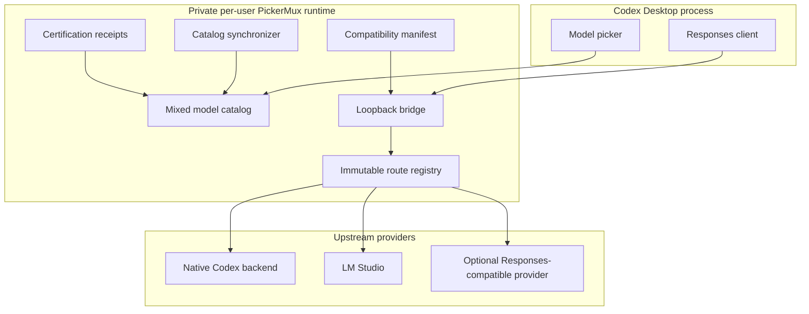

# PickerMux Architecture

This document describes the public v0.5.4 bridge contract. It is intended for
contributors, security reviewers, and users who want to understand what runs on
their Mac.

## Design goals

PickerMux is designed around five invariants:

1. Native Codex models and external models share a picker, not a trust domain.
2. A model slug must resolve to exactly one immutable route.
3. Native credentials and metadata must never reach an external provider.
4. External capabilities must be measured rather than assumed.
5. Installation and refresh must either complete fully or restore the previous
   working state.

## Components

The service is installed as a user LaunchAgent. Its runtime copy lives outside
the source checkout so macOS privacy protection on folders such as Documents
does not break login-time startup.

## Catalog construction

PickerMux builds the catalog in the following order:

1. Read the bundled catalog from the installed Codex client as a schema donor.
2. Read the authenticated account snapshot from `models_cache.json`.
3. Require the account snapshot to match the installed Codex client version for
   `install` and `refresh`.
4. Discover external provider models under the configured policy.
5. Build conservative catalog records from the donor schema and measured
   provider metadata.
6. Apply valid model-specific certification receipts.
7. Validate the default selection and every expected catalog slug through the
   Codex client.
8. Atomically publish the catalog and compatibility manifest.

The account snapshot is the source of truth for native model visibility. The
bundled catalog is not used to invent account access. The preview-only `build`
command can use the bundle as a diagnostic fallback, but persistent installation
cannot. Once the snapshot is structurally valid and matches the exact installed
Codex client version, elapsed time alone does not make it stale. Its
`fetched_at` value and derived age are diagnostic metadata; missing, malformed,
unsafe, future-dated, or version-mismatched snapshots still fail closed.

External slugs must begin with their provider namespace, such as
`lmstudio/qwen/qwen3.8-27b`. An unknown, differently cased, or prefix-only slug
fails before an upstream request is opened.

## Routing boundary

The bridge binds to IPv4 loopback only. Its URL contains a high-entropy random
capability segment stored in private runtime files. Host, Origin, method, path,
query, and protocol-upgrade checks fail closed.

### Native route

For an exact native slug, PickerMux forwards only the explicitly approved
authentication, routing, tracing, content, and compression headers needed by
the native Codex request. Request bodies and server-sent events remain byte
preserving on this route.

### External route

For an exact namespaced external slug, PickerMux discards the caller's header
set and constructs a new provider request. ChatGPT bearer tokens, cookies,
account identifiers, attestation values, and Codex metadata are not eligible for
the external header set. The external JSON body also excludes Codex
`client_metadata` and internal content annotations. Ordinary provider API
`metadata` remains part of the caller's request contract. Native request bodies
remain byte preserving.

Provider credentials are resolved only for the selected route. Persistent
providers can use a provider-scoped macOS Keychain item. Successful lookups are
coalesced and held in memory for no more than 30 seconds; values are not written
to logs, status output, configuration, or certification records.

## LM Studio adaptation

Codex and local models do not always expose identical Responses API behavior.
The LM Studio adapter therefore performs bounded, explicit normalization:

- rewrites the public namespaced slug to the upstream LM Studio model ID;
- gives uncertified text-only models a compact assistant prompt instead of the
  donor Codex coding-agent prompt;
- builds that text-only model-message profile from an allowlist, so optional
  agent fields added to a future donor cannot silently re-enable bootstrap
  context;
- maps supported reasoning levels and omits only known synthetic defaults;
- removes unsupported cache and encrypted-reasoning fields;
- for an uncertified LM Studio route, removes allowlisted generated
  cross-thread-memory, skill-catalog, permission, app/plugin/environment usage,
  collaboration/multi-agent, deferred-tool, and plugin-recommendation bootstrap
  before the first conversation item. Each removal requires its private Codex
  annotation, expected incoming role, exact message/content shape, and any
  per-kind placement or complete-envelope constraint. Memory and multi-agent
  kinds use their private semantic provenance instead of release-specific
  wording hashes. Generic developer/app/thread context is always retained, but
  does not stop later independently verified generated fragments from being
  removed. Unknown kinds, wrong roles, malformed envelopes, and mixed
  annotations retain the item and stop further compaction. Unknown structural
  fields are rejected before forwarding instead of being guessed or silently
  discarded;
- preserves user messages, images and audio, current environment facts,
  AGENTS/project and managed instructions, selected skill instructions, and
  conversation history. The latency-first text-only route deliberately omits
  Codex cross-thread memory and agent-mode policy; certified LM Studio routes
  retain the full context;
- combines system and developer messages into one leading system block while
  preserving chronological content;
- removes unsupported optional built-in tools;
- removes every optional function schema for an uncertified model and rejects
  forced choices or tool-call history on that text-only route;
- rejects a required tool choice when normalization would make it impossible;
- maps arbitrary Codex tool namespaces to collision-resistant function names;
- restores public namespace names in JSON and streaming responses;
- normalizes empty function parameter schemas.

Successful tool certification restores the full donor coding-agent prompt and
preserves its annotated context because those models can use the corresponding
Codex tool surface. Certification traffic itself receives the same treatment.

Request decompression supports gzip, deflate, Brotli, and Zstandard. Decoded
body size, response header size, header wait, stream idle time, and total
upstream duration are all bounded.

For each compacted text-only request, the service keeps only an in-memory
telemetry snapshot and saturating aggregate counters. The schema consists of
fixed status enums, booleans, and byte/part counts; it cannot contain prompt
text, raw annotation kinds, model or provider names, IDs, hashes, URLs, or
paths. The capability-scoped health endpoint lets `doctor` report how much
context was omitted or retained without parsing request logs.

## Discovery and synchronization

The default LM Studio provider uses `loaded` discovery. It prefers
`/api/v1/models`, which reports loaded instances and active context sizes. A
fallback to `/v1/models` is accepted only when model type and context metadata
are explicit.

The persistent service observes Codex Desktop through LaunchServices:

- while Codex is running, endpoint discovery is paused and only local process
  state is checked;
- after Codex fully quits, synchronization begins promptly;
- while Codex remains closed, provider discovery is rate limited;
- a deliberate LM Studio connection refusal is treated as an empty loaded set;
- malformed data, timeouts, HTTP failures, and other transient errors retain the
  last known good state.

Catalog and route-registry publication is staged. The running compatibility
gate is checked before selection reconciliation, catalog publication, and
route-registry replacement. If compatibility changes or any publication step
fails, PickerMux rolls back the affected selection/catalog state and does not
expose the new registry.

## Tool certification

New external models are published with `tool_mode = null` and shell access
disabled. Certification runs seven serial Responses requests covering eight
required gates:

- `text`;
- `stream`;
- `function`;
- `parameterless`;
- `namespaceJson`;
- `namespaceStream`;
- `toolResult`;
- `longContext`.

Before probing, PickerMux invalidates the previous receipt and publishes a
text-only catalog. An interrupted or failed run therefore cannot preserve an
old tool grant. Certification requests carry a private per-runtime marker so
the bridge can exercise its tool adapter without reopening tools to ordinary
Codex traffic; the marker is removed by the external header allowlist. A
successful receipt is bound to the provider kind and ID, base URL, public and
upstream model IDs, active context size, reasoning metadata, capability
metadata, and Codex client version.

Receipts contain only the fingerprint, timestamp, and gate outcome. They do not
contain prompts, responses, or credentials.

## Installation and rollback

The integration installer owns only marked Codex configuration fields and
explicit files under `~/.codex/model-bridge`, plus its named LaunchAgent. It
creates a verified backup before changing Codex configuration.

The ownership receipt also permits one narrow, write-free recovery: if only the
managed provider end marker is missing, PickerMux tests the safe line boundaries
between the provider table and the next TOML table or end of file. It virtually
reinserts the exact marker only when one unique candidate reproduces the
receipt's SHA-256 block digest and every preserved tail line is blank or a
comment. Status exposes `installed-marker-recovered`; refresh, selection changes,
and uninstall can then proceed without silently rewriting the config. One
narrow setup-recovery exception materializes the exact marker when this state
coincides with a failed initial account-cache preflight: the downloaded payload
uses the lifecycle lock, revalidates configuration ownership and status, and
atomically inserts only the receipt-proven line so an older installed CLI can
uninstall. Missing begin/root markers, duplicate boundaries, provider-scoped
content changes, and every ambiguous candidate remain inconsistent.

Install and refresh stage the runtime, catalog, compatibility manifest, service
configuration, and selection update. The previous runtime package remains
available until catalog validation, bridge restart, Codex schema checks, and
the doctor all pass. A failure restores the previous files and service state.

### Full account-cache refresh

`refresh --full` is a separate, explicitly confirmed recovery transaction. It
is not an age-triggered variant of ordinary `refresh`, and it rejects structured
`--json` execution because the confirmation and application handoff are part of
its safety contract.

Before Codex is asked to quit, PickerMux creates a private checkpoint with
operation metadata and the initial phase while holding the same lifecycle lock
used by the receipt-bound one-time helper. The helper waits for that bounded
lock handoff before continuing outside the Desktop process. Its cache-related
fields are limited to the expected client version and `fetched_at` timestamps;
it stores neither catalog contents nor account identity. The helper:

1. requests a normal Apple-event quit and waits for stable LaunchServices
   confirmation that Codex is stopped;
2. suspends the managed PickerMux integration without purging the installed
   configuration, certification receipts, verified backups, distribution, or
   provider credentials;
3. opens Codex by bundle identifier with a narrow macOS session environment and
   waits for a structurally valid account cache whose client version is exact;
   if a valid baseline existed, the new fetch timestamp must be later;
4. requests and verifies a second graceful quit before any integration write;
5. reactivates the preserved configuration through the normal transactional
   refresh gates, then opens Codex so the new mixed catalog is loaded.

All application-state and lock-handoff waits are bounded. A rejected or
timed-out quit is never converted into `SIGKILL` or another forced termination.
After suspension begins, the helper preserves a private checkpoint through
receipt-bound artifact cleanup so an interrupted run can resume from its last
recorded phase while each lifecycle callback revalidates live Codex,
distribution, configuration, and service state. Concurrent lifecycle commands
cannot reuse the checkpoint, plist, or log paths during that cleanup. An
indeterminate `launchctl` result or unreadable checkpoint fails closed and
retains recovery state. A failed reactivation is never reported as a completed
full refresh.

Release setup validates the account-scoped Codex cache before staging a new
distribution, repeats the same read-only preflight under the lifecycle lock
before changing active CLI controls, and performs it once more immediately
before integration activation. A missing, malformed, or client-version-
mismatched cache therefore stops without changing active PickerMux distribution
or runtime state and cannot silently fall back to the bundled catalog. If the
sole existing integration defect is a receipt-recovered provider end marker,
the first preflight may restore that marker without activating the downloaded
CLI or runtime; the reported recovery instructions can then be completed by an
older CLI. The account-cache reader
opens only the exact `models_cache.json` inode and rejects symbolic or multiple
hard links before reading its payload, so it cannot be redirected to native
Codex authentication state.

Uninstall restores the verified prior Codex values and removes managed runtime
artifacts. It intentionally leaves backup directories and provider Keychain
items alone.

The release installer adds a separate, receipt-governed distribution layer.
Versioned CLI payloads live below
`~/Library/Application Support/PickerMux/versions`, an atomically replaced
`current` link selects the active payload, and `~/.local/bin/pickermux` is the
user-facing launcher. Setup never overwrites an entry or directory that cannot
be proven to belong to its private receipt.

Release activation reuses the same integration transaction: a fresh setup runs
install, while a healthy existing setup runs refresh using its installed
provider configuration. The distribution pointer is restored if activation
fails, and download, digest, or archive-validation failures occur before any
persistent mutation. Concurrent setup and removal are serialized by a private
installation lock.

Integration uninstall and distribution removal are intentionally distinct.
`uninstall` restores Codex and removes the bridge runtime; the explicit
`--remove-cli` option additionally removes only receipt-owned launcher and
version directories. Owned CLI paths are first moved into a private quarantine;
only then is the integration removed. A partial quarantine-cleanup failure
in this distribution layer cannot recreate or fragment the active installation
and does not block a later setup. After integration removal, the staged receipt,
launcher, pointer, versions, SHA-256 digests, and device/inode identities are
revalidated. Cleanup unlinks only that exact inventory and removes empty
directories without recursive deletion. Neither mode purges backups or
Keychain credentials.

Before any uninstall mutation, `runtime-app` is inventoried and compared
byte-for-byte with the invoking source distribution. Symlinks, special files,
modified or additional entries, and residual `runtime-app.previous-*` packages
fail closed. The accepted tree is renamed, revalidated by content digest and
filesystem identity, and removed one exact file and empty directory at a time;
runtime cleanup never uses recursive deletion.

The explicit `uninstall --purge` mode implies receipt-validated CLI removal and
also removes only validated PickerMux backup files and provider Keychain items
listed in the private, secret-free credential registry. Backup and registry
state is inventoried, quarantined, and revalidated before exact cleanup. It
rejects foreign or modified LaunchAgents, unexpected backup contents, unsafe
paths, and invalid ownership state. Native Codex credentials and unrecognized
files are always outside its scope; `~/.codex/auth.json` is never read,
modified, or removed.

The canonical `model_bridge` full-purge configuration restoration atomically
appends its marker-bounded historical compatibility provider table. It is
credential-free, loopback-only at port zero, and has no retries, so it
satisfies Codex's provider lookup for old chats without reviving a route. During
a later installation, PickerMux removes only the byte-exact table at the end of
the config before taking the new backup; any changed or foreign table remains a
provider-table conflict. The marker carries only a config-file retention bit.
It is false only when the path was absent before installation and no user bytes
survive restoration, so a later ordinary uninstall preserves absence, an empty
existing config, or surviving user content without storing that content.

Runtime, backup, and registry quarantines are separate from the distribution
quarantine. If one of their exact cleanups remains pending, purge fails and the
receipt-owned CLI is retained or restored for recovery instead of reporting a
successful full removal.

Credential mutation, install, refresh, certification, and purge serialize
registry updates through the same private lifecycle lock. Successful install
and refresh register configured Keychain provider IDs so upgrades from a
pre-registry release retain exact, secret-free deletion ownership. Registry
entries use the configuration's canonical provider-ID grammar and
127-character maximum.

Because macOS Keychain cannot atomically delete several items, the credential
phase begins only after CLI, registry, backup, runtime, and configuration
ownership has been staged or revalidated. Credential values are never read for
rollback. A partial credential failure leaves the integration active and
restores reversible state for an idempotent retry, while exact entries already
deleted remain absent. An integration failure after the credential phase also
retains the CLI and ownership receipts and is reported as an incomplete commit.

Receipts, hashes, inode identity, private random quarantines, and the lifecycle
lock protect against stale state and drift observed by cooperating PickerMux
commands. The final file removal primitive remains pathname based; a malicious
process already running as the same macOS user can race that last syscall. This
same-user boundary is explicit in `SECURITY.md`, and no purge path broadens into
recursive deletion.

## Compatibility contract

The installed `compatibility.json` binds the bridge contract to the Codex client
version and a canonical fingerprint of the bundled catalog. `status`, `doctor`,
bridge startup, and the running service validate this contract. The service
checks the Codex executable identity cheaply before model requests and on a
short background interval; an identity change triggers an atomic full version
and bundled-catalog recheck. An unknown, changed, or temporarily unverifiable
contract quarantines model and catalog publication traffic with a stable 503.
The private health endpoint remains available with fixed safe status/reason
enums so the LaunchAgent does not enter a restart loop and diagnostics can
direct the user to refresh.

`doctor` also runs the account-cache inspection as an independent check. It can
therefore report whether the signed-in account cache matches the current Codex
client even when the bridge runtime or generated mixed catalog is absent.

## Private local data

The managed data directory is `~/.codex/model-bridge` unless `CODEX_HOME` is
overridden.

| Artifact | Purpose | Expected mode |
| --- | --- | --- |
| `models.json` | Generated mixed model catalog | Private file |
| `state.json` | Managed Codex configuration ownership state | Private file |
| `runtime.json` | Capability and runtime coordinates | Private file |
| `service-config.json` | Installed secret-free provider configuration | Private file |
| `certifications.json` | Model-bound tool certification receipts | Private file |
| `compatibility.json` | Installed client and catalog contract | Private file |
| `keychain-state.json` | Secret-free registry of PickerMux provider credential IDs | Private file |
| `runtime-app/` | Self-contained service runtime | Private directory |
| `backups/` | Verified configuration backups | Private directory |

The LaunchAgent is stored at
`~/Library/LaunchAgents/com.local.codex-model-bridge.plist`.

Release-distribution metadata is stored separately below
`~/Library/Application Support/PickerMux` so CLI version management cannot be
confused with Codex configuration ownership. The bounded full-refresh helper,
its private checkpoint, and its diagnostic log live in the dedicated
`full-refresh/` subdirectory rather than in Codex authentication state. The
subdirectory is removed after success and retained for an explicitly resumable
failure.
