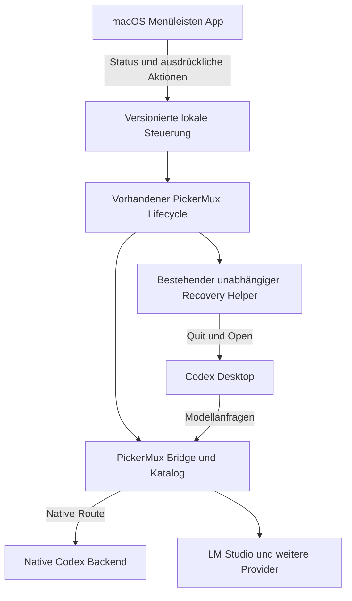

# PickerMux Optimierung und macOS Erweiterung

Stand: 1. Oktober 2026. Ausgangsanalyse auf Basis von PickerMux v0.8.3,
Repository-Commit `bb4a02d`; Umsetzung für v0.9.6 auf dem Topic-Branch.
Der Maintainer hat v0.8.3 selbst live getestet und die Umsetzung aller sechs
Phasen ausdrücklich freigegeben. Diese Rückmeldung gilt als funktionierende
Ausgangsbasis; sie ersetzt nicht die Live-Abnahme der neuen App und Recovery.

Implementiert sind die explizite Provider-Qualifikation, die versionierte
Kontrollschnittstelle, die SwiftUI-Menüleisten-App, bestätigte Recovery über
den bestehenden unabhängigen Helper, die CAS-geschützte Konfigurationsmigration
und die Build-/Signier-/Notarisierungspipeline. Der kompakte eingebaute Provider
bleibt wegen seiner Retry-/WebSocket-Vorgaben gesperrt. Ein lokaler unsigned
Build dient der Entwicklungsprüfung; ein signiertes Release erfordert eine
verfügbare Developer-ID-Identität und das benannte notarytool-Profil.

PickerMux soll leichter zu konfigurieren und nach Codex-Updates wieder nutzbar
sein. Empfohlen wird eine native macOS-Menüleisten-App, die den vorhandenen
PickerMux-Kern bedient. Die schlanke Ollama-Integration ist ein sinnvoller
Vergleich, aber ihre Transportvorgaben unterscheiden sich von PickerMux.
Deshalb geht einer Umstellung des Codex-Providers ein begrenzter
Kompatibilitätsnachweis voraus. Die App kann unabhängig von dessen Ergebnis
entstehen.

Mit „Laden und Aktualisieren“ ist im ersten Umfang gemeint: den PickerMux-Dienst
bereitstellen, die Integration prüfen, den Modellkatalog aktualisieren und
Codex bei Bedarf kontrolliert neu starten. Das Laden bereits vorhandener
Modellgewichte in den Arbeitsspeicher ist eine gesonderte Erweiterung.

## Ergebnis der Bestandsaufnahme

Der angeforderte GitHub-Pull wurde als Fetch mit anschließendem Fast-forward
von `891be43` auf `bb4a02d` durchgeführt. Vorhandene uncommittete
Planungsdateien wurden erhalten. Der neue Plan liegt auf dem lokalen Branch
`codex/macos-companion-plan`; es wurde nichts veröffentlicht.

Die Ausgangsbasis bestand `npm run verify` mit 1.064 Tests und Syntaxprüfungen unter Node.js
26.10.0. Der erste Testlauf scheiterte an der Sandbox-Sperre für lokale
Testserver; der erlaubte Wiederholungslauf war erfolgreich. Das ist eine
Offline-Prüfung der Ausgangsbasis. Es wurden keine Installation,
Reparatur, Zertifizierung oder Modellanfrage am produktiven System ausgeführt.

Die lokale Konfiguration wurde ausschließlich als reduzierte Struktur geprüft.
Sie verwendet einen Ollama-Katalog und `openai_base_url`, ohne aktives
`model_provider`. Der vorhandene `model_bridge`-Provider ist eine inaktive
Kompatibilitätstabelle mit Loopback-Port null, ohne Authentifizierung und mit
null Wiederholungsversuchen. Sie ist für historische Chats relevant und darf
bei einer optischen Bereinigung nicht entfernt werden. Zugangsdaten,
Modellnamen und Capability-Adressen wurden nicht ausgegeben.

Der lokale Ollama-Client meldet Version 0.35.0. Seine Servererreichbarkeit wurde
nicht verlässlich außerhalb der Sandbox geprüft; daraus folgt keine Aussage
über den produktiven Betriebszustand.

Seit dem vorherigen lokalen Stand enthält PickerMux unter anderem Efficient
Fidelity, Compaction-Anpassungen, gemeinsame Websuche, automatische
Installationszertifizierung sowie Reparaturen für historische Chats und
Codex-Updates. Diese Funktionen bilden die Ausgangsbasis; der alte lokale
Fast-Agent-Entwurf ist kein Ersatz für die aktuelle Architektur.

## Warum Ollamas Konfiguration kürzer ist

Die verlinkte [offizielle Ollama-Integration](https://docs.ollama.com/integrations/chatgpt)
fügt kompatible lokale und Cloud-Modelle zum gemeinsamen Desktop-Picker hinzu.
Ihr [Renderer in v0.35.0](https://github.com/ollama/ollama/blob/v0.35.0/cmd/launch/codex_app.go)
verwendet hauptsächlich `model`, `model_catalog_json` und `openai_base_url`;
`model_provider` wird entfernt. Zusätzliche Desktop-Reasoning-Einstellungen
und separate Katalogdateien bleiben möglich.

PickerMux v0.8.3 erzeugt vier Root-Zuweisungen und neun aktive
Provider-Zuweisungen. Eine zusätzliche Search-Feature-Einstellung wird nur
hinzugefügt, wenn kein ausdrücklicher Benutzerwert besteht. Die größere
Provider-Konfiguration steuert konkrete Eigenschaften:

| Eigenschaft | PickerMux v0.8.3 | Bedeutung für die Optimierung |
| --- | --- | --- |
| Aktiver Provider | Explizites `model_bridge` | Ein Wechsel beeinflusst auch Provideridentitäten historischer Chats. |
| Transport | Responses über HTTP und SSE, WebSockets ausgeschaltet | Ein kürzerer Modus muss denselben unterstützten Transport verwenden. |
| Wiederholungsversuche | Request und Stream jeweils null | Automatische Wiederholung nach Teilantworten darf nicht beiläufig eingeführt werden. |
| Authentifizierung | Native Auth nur auf nativen Routen, externer Header-Neuaufbau | Eine kürzere TOML ändert den Router und seine Vertrauensgrenzen nicht. |
| Tools | Exakte Modellzertifizierung, Direct und Efficient Fidelity | Anbieter-Metadaten oder ein erfolgreicher Texttest ersetzen keine Zertifizierung. |
| Katalog | Account-Cache passend zum Codex-Client plus konservative externe Einträge | Ein gebündelter Katalog darf keine Account-Berechtigungen erfinden. |
| Lokaler Zustand | Receipts, Backups, Kataloge und Provider-Konfiguration bereits ausgelagert | Große Verwaltungsdaten stehen heute schon außerhalb der Codex-TOML. |

Die [aktuelle Codex-Konfigurationsreferenz](https://learn.chatgpt.com/docs/config-file/config-reference)
beschreibt den Katalog als beim Start geladen und reserviert die eingebauten
Provider-IDs. Request-Retries haben standardmäßig den Wert vier, Stream-Retries
fünf. Eine eingebaute Providerdefinition lässt sich nicht einfach durch eine
gleichnamige benutzerdefinierte Tabelle ersetzen. Die konkrete installierte
Desktop-Version muss zusätzlich qualifiziert werden; die aktuelle Dokumentation
oder der bewegliche öffentliche Quellstand beweisen ihr Verhalten nicht.

Ollamas Renderer behandelt außerdem `auth.json`. Dieses Vorgehen wird nicht
übernommen: PickerMux liest diese Datei gemäß seinem Sicherheitsvertrag nicht.
Auch Unterschiede bei unbekannten Modellrouten, unklaren Schemas oder nativen
Request-Bytes sind kein Vorbild für eine Lockerung der vorhandenen Grenzen.

## Ziel für die Codex Konfiguration

Es werden zwei Ergebnisse unterschieden:

1. **Verbindlicher erster Umfang:** Nur tatsächlich notwendige
   Integrationsfelder schreiben, das Layout und die Ownership-Markierungen
   vereinheitlichen und sämtliche Verwaltungsinformationen weiterhin privat
   außerhalb der TOML halten. Bestehende Benutzerwerte werden nicht neu
   formatiert. Explizite Transportkontrollen bleiben bestehen.
2. **Bedingter kompakter Modus:** Den eingebauten OpenAI-Provider mit einem
   PickerMux-Katalog und einer PickerMux-Loopback-Adresse verwenden, sofern alle
   Sicherheits- und Kompatibilitätsprüfungen bestehen. Dieser Modus wird nicht
   allein wegen einer geringeren Zeilenzahl aktiviert.

Der zweite Modus hätte als Konzept nur zwei Integrationsfelder:

```toml
# Konzept mit Platzhaltern, kein Installationsbeispiel
model_catalog_json = "/ABSOLUTE_PRIVATE_DIRECTORY/models.json"
openai_base_url = "http://127.0.0.1:4210/PRIVATE_CAPABILITY/v1"
```

Modellauswahl, Reasoning-Auswahl, erforderliche Search-Einstellungen und
historische Provider-Aliase kommen gegebenenfalls hinzu. Auch eine erfolgreiche
Migration muss daher nicht so kurz aussehen wie eine frische Installation.
Ein allgemeiner TOML-Include-Mechanismus wird nicht vorausgesetzt.

Vor der Entscheidung werden Authentifizierung, native/externe Route,
WebSocket-Ausschluss und Fallback, Request-/Stream-Retries, Stream-Idle-Timeout,
Search, Direct, Efficient Fidelity sowie V2-Compaction
mit verschlüsseltem Replay anhand der konkreten Codex-Version untersucht.
Ist die notwendige Steuerung beim eingebauten Provider nicht erreichbar,
bleibt der explizite Provider der unterstützte Modus.

Eine Modusmigration braucht einen versionierten Ownership-Zustand mit
Integrationsmodus und getrennten historischen Alias-Receipts. Bestehende
Receipts bleiben lesbar. Backups, Compare-and-swap, konkurrierende Änderungen,
Selektions-Reconciliation, Doctor, Refresh, Full Refresh und Uninstall müssen
beide Zustände verstehen. Ein reiner Moduswechsel bewahrt die Capability,
sofern der Protokollnachweis dies erlaubt; ein unnötiger Schlüsselwechsel würde
vorhandene verschlüsselte Compaction-Fortsetzungen ungültig machen.

Ollama und PickerMux beanspruchen denselben Root-Katalog und dieselbe
Provider-/Gateway-Auswahl. Der erste Umfang unterstützt deshalb einen klaren
Eigentümer der aktiven Integration. Die App erkennt Ollama, zeigt einen
Konflikt oder bietet einen ausdrücklich gestarteten Wechsel mit Vorschau,
verifiziertem Backup und Wiederherstellung an. Zwei unabhängige Schreiber oder
ineinander verkettete Gateways werden nicht automatisch eingerichtet.

## Architektur der macOS Erweiterung

Die Empfehlung ist eine SwiftUI-Menüleisten-App. Apples
[MenuBarExtra](https://developer.apple.com/documentation/swiftui/menubarextra)
ist dafür der passende Einstieg. Ein optionaler Start bei Anmeldung kann über
[SMAppService](https://developer.apple.com/documentation/servicemanagement/smappservice)
erfolgen. Mindestversion, Apple-silicon-/Intel-Builds und Signierungsverfahren
werden vor Beginn der App-Implementierung verbindlich festgelegt.



Die GUI enthält keine zweite Implementierung für Konfigurationsänderung,
Zertifizierung, LaunchAgent-Ownership oder Rollback. Der bestehende
Node.js-Kern bleibt autoritativ. Zunächst verwendet die App einen geprüften
absoluten Runtime-/CLI-Pfad und Argumentlisten mit einer eng begrenzten
Umgebung. Es gibt keine Shell-Interpolation und keine neue öffentliche
HTTP-Steuerschnittstelle. Der LaunchAgent der Bridge behält seinen bisherigen
Owner; der optionale GUI-Autostart erzeugt keinen zweiten Bridge-Dienst.

Die App ist im ersten Release ein Companion zur vorhandenen Distribution.
Node.js bleibt eine dokumentierte Voraussetzung. Ein späteres Komplettpaket
mit gebündelter Runtime benötigt einen eigenen Build-, Signierungs- und
Updatevertrag und ist kein stillschweigender Teil dieses Plans.

Heute vorhandenes `status --json` ist noch kein stabiler GUI-Vertrag. Benötigt
werden eine Schemaversion, sichere Fehlercodes, Teilergebnisse bei defekten
Installationen, Codex-/Cache-Zustand, erlaubte nächste Aktionen und
strukturierter Fortschritt. Die GUI erhält keine Capability, Credentials,
Account-Identitäten, Prompts oder Rohdiagnostik. Eine lokal erzeugte
Operations-ID darf einen gestarteten Vorgang und seinen Checkpoint verbinden.

## Bedienung und Verhalten nach einem Codex Update

Die Menüleiste zeigt eine verständliche Zustandsmeldung und genau die
verfügbaren Aktionen. Vorgesehene Aktionen sind „Picker aktualisieren“,
„Codex mit aktualisiertem Picker öffnen“, „Nach Codex-Update reparieren“,
„Zertifizierung starten“ sowie „PickerMux aktualisieren“. Modellzertifizierung
bleibt eine bewusst gestartete Live-Aktion; sie kann mehrere Minuten dauern.

Der vorhandene Runtime-Gate erkennt Änderungen an der tatsächlichen
Codex-Executable vor Modellanfragen und im Hintergrund. Die App beobachtet
dessen Zustand; sie entscheidet nicht selbst über die Sicherheit einer Route.
Ein bekanntes Update löst eine Hinweis- und Prüfphase aus. Benachrichtigungen
erscheinen bei relevanten Zustandswechseln, nicht bei jedem Poll.

| Zustand | Reaktion |
| --- | --- |
| Kompatibel, Katalog aktuell | Dienst verfügbar; Codex öffnen anbieten. |
| Refresh angefordert, Codex geöffnet | Aktualisierung vormerken; Provider-Discovery bleibt bis zum vollständigen Quit pausiert. |
| Codex geschlossen und Cache passend | Normalen transaktionalen Refresh ausführen; Automatik nur nach Opt-in. |
| Codex aktualisiert und Account-Cache unpassend | Bestätigte vollständige Recovery anbieten. |
| Konfiguration fremd oder geändert | Vorschau und Konflikt anzeigen; keine automatische Überschreibung oder `--force`. |
| Recovery unterbrochen | Nach erneuter ausdrücklicher Bestätigung Checkpoint prüfen und denselben Vorgang wiederaufnehmen. |
| Modellzertifizierung fehlt oder ist stale | Text-only beziehungsweise blockierten Zustand darstellen und gezielte Zertifizierung anbieten. |

Die vollständige Recovery nutzt den vorhandenen Ablauf:

`vorbereiten → Codex beenden → Integration suspendieren → Codex nativ öffnen
→ passenden Cache abwarten → Codex erneut beenden → Integration reaktivieren
→ Codex öffnen`

Eine native Bestätigung erklärt die beiden Quit-Vorgänge und mögliche
Unterbrechungen aktiver Aufgaben. Der neue GUI-Einstieg führt unter denselben
Locks und Receipt-Prüfungen in den bestehenden Helper. Die App simuliert kein
Terminal und speist nicht automatisch das CLI-Bestätigungswort `FULL` ein.
Normaler Refresh beendet Codex nicht, und Cache-Alter allein verlangt keine
Recovery. Abgelehnter oder zu langsamer Quit führt niemals zu einem Kill.

Full Refresh ersetzt derzeit die Capability und kann dadurch frühere
verschlüsselte Compaction-Fortsetzungen invalidieren. Dies muss der
Recovery-Dialog als konkrete Wiederaufnahmegrenze erklären. Zertifizierungen
bleiben als Belege erhalten; nach einem Clientwechsel gilt nur eine weiterhin
passende, exakte Zertifizierung als Tool-Freigabe.

## Umsetzungsphasen und Abnahme

| Phase | Ergebnis | Abnahme |
| --- | --- | --- |
| 1 Konfiguration qualifizieren | Begrenzter Spike zum eingebauten Provider und Entscheidung für den unterstützten Modus; sichere Vorschau eines Integrationswechsels. | Transport, Retry-Verhalten, Stream-Idle-Timeout, Routing, Search, Tools, Compaction und historische Chats belegt; andernfalls expliziten Provider behalten. |
| 2 Steuerungsschnittstelle schaffen | Backend-Fassade für Status, Fehler, Aktionen und Ereignisse; bestehende CLI verwendet denselben Kern. | Versionierte Schemas, verständliche Teilergebnisse und sichere Fehlercodes; unbekannte Versionen und parallele Mutationen blockieren sicher. |
| 3 Menüleisten App liefern | Native Statusanzeige, Diagnose, Dienst-/Katalogbedienung und regulärer Refresh; bestehende Provider-Integration bleibt nutzbar. | Bedienbar ohne manuelle TOML-Bearbeitung; keine direkte State-/Config-Manipulation durch Swift; CLI-Pfade und Umgebung geprüft. |
| 4 Update Recovery integrieren | Nativer Bestätigungsdialog, unabhängiger Helper, Fortschritt, Wiederaufnahme und Öffnen von Codex. | Fehler und Abbrüche in jeder Phase getestet; reale macOS-Update-/TCC-Abnahme; kein unbestätigtes Quit. |
| 5 Konfiguration migrieren | Bereinigter Renderer beziehungsweise qualifizierter kompakter Modus mit kompatiblen Receipts. | LF/CRLF, User-Edits, Ollama-Konflikte, Backup, CAS, Rollback, Uninstall und historische Chatöffnung bestehen. |
| 6 App verteilen und aktualisieren | Signierte/notarisierte App und installierbares DMG, geprüfte Versionsanzeige und opt-in GUI-Autostart. | Versionierte Downloads, Digest-/Archiv-/Receipt-Prüfungen, atomare Aktivierung und Rollback; DMG-Mount, Drag-to-Applications und App-Start geprüft; App-/CLI-Versionskonflikte werden erklärt. |

Phase 1 und der Entwurf von Phase 2 können parallel erfolgen. Phase 3 benötigt
Phase 2; Phase 4 baut auf beiden auf. Die App muss nicht auf den optionalen
kompakten Integrationsmodus warten. Phase 5 setzt die Modusentscheidung voraus.
Kleine PRs trennen Steuerungsvertrag, GUI, Recovery und Migration.

Die Release-Aktualisierung übernimmt die vorhandene Distributionstransaktion
statt eines Shell-Pipes im GUI-Prozess. Die App kann ein verfügbares Update
zeigen und vorab prüfen; die Aktivierung wird bewusst gestartet. Sie bleibt
von der Recovery nach einem Codex-Update getrennt.

Der Companion-Build erzeugt zusätzlich zum Universal-Archiv ein versioniertes
`PickerMux-v0.9.6-macos-universal.dmg`. Das Image enthält ausschließlich
`PickerMux.app` und einen `Applications`-Link auf `/Applications`. Nutzer
kopieren die App nach „Programme“, werfen das Image aus und öffnen die
kopierte App. Node.js 22.15+ bleibt eine externe Voraussetzung. Das Kopieren
installiert weder CLI noch Bridge und ändert keine Codex-Konfiguration;
die Einrichtung erfolgt über die bestätigte Vorschau und bestehende
Installationstransaktion.

Der Builder prüft die Image-Integrität, das komprimierte Read-only-Format und
den read-only gemounteten Inhalt einschließlich aller App-Dateien und Modi.
Manifest und Prüfsummen binden sowohl Archiv als auch DMG. Im Release-Modus
werden zunächst App und anschließend DMG separat mit Developer ID signiert,
notarisiert, gestapelt und geprüft. Der geschützte Workflow bewahrt beide
Artefakte zur Review auf; eine Veröffentlichung ist ein eigener Schritt.
Unsignierte Entwicklungsimages bleiben als Testartefakte gekennzeichnet.

Der Implementierungsstand besteht `npm run verify` mit 1.255 Offline-Tests
und den Syntaxprüfungen. 59 Swift-Tests prüfen die echten
Protokoll-Fixtures, Receipt-/Datei-/Runtime-Prüfungen, Bestätigungen und
begrenzte Subprozesse. Der Universal-Build wird für `arm64` und `x86_64`
erstellt; seine eingebetteten Backend-Dateien müssen dem geprüften Source-Stand
entsprechen.
Die DMG-Erstellung besteht 42 isolierte Packaging-Prüfungen innerhalb der
Node-Tests, einschließlich der AppIcon-Erstellung und ihrer Fehlerpfade.
Der reale Universal-Build mit Xcode 27.0 sowie die Prüfsummen, UDZO-Format-
und gemountete Inhaltsprüfung einschließlich aller Dateiberechtigungen
bestehen; das Image wurde anschließend erfolgreich ausgeworfen.

Die erste manuelle App-Installation zeigte einen Fehler in der Node-Erkennung:
Homebrews übliche Admin-Gruppenrechte an `bin` und `Cellar` wurden abgelehnt.
Die Korrektur erlaubt ausschließlich diese exakten Verzeichnisse unter
`/opt/homebrew` und `/usr/local` mit Modus `0775`, passendem Eigentümer und
der vom Betriebssystem aufgelösten Gruppe `admin`. Andere beschreibbare
Verzeichnisse, unsichere Symlink-Eltern und ungeprüfte Runtime-Ziele bleiben
gesperrt. Neun isolierte Tests prüfen die positiven und negativen Grenzen.
Die korrigierte Startkette erkennt den vorhandenen Node 26.10.0 und liefert
Status und Konfigurationsvorschau mit dem neu gebauten Backend erfolgreich
in einem temporären Benutzerverzeichnis. Codex erzeugt dabei seine temporären
CLI-Starthelfer; PickerMux-Konfiguration, Distribution und LaunchAgent bleiben
unangelegt. Statusprüfung, Hilfe, Einstellungen und Beenden sind auch bei
einem Startfehler erreichbar.

Nach der manuellen Startprüfung ergänzt v0.9.1 einen sichtbaren Codex-Schalter:
Einschalten zeigt eine frische Konfigurationsvorschau und verlangt die
Bestätigung der Aktivierung. Ausschalten setzt Codex auf seine native
Konfiguration zurück und stoppt die Bridge; Runtime, Originalbackup und
Zertifizierungen bleiben für die Reaktivierung erhalten. Fremde oder inzwischen
geänderte Dateien werden nicht überschrieben. Ein eigener Suspensionstyp
trennt diese dauerhafte Deaktivierung von der temporären Full-Refresh-Recovery.
Fehler bei fehlendem Provider, geladenem Modell oder Account-Cache werden
gezielt angezeigt; eine frische Installation gilt nicht mehr fälschlich als
Codex-Update. Die App prüft die Toggle-Protokollfähigkeit vor einer Mutation
und verwendet bei älteren Installationen ihr verifiziertes Setup-Backend.
Die neue Version erhält einen eigenen unveränderlichen Distributionspfad,
damit ein installiertes v0.9.0 sicher aktualisiert werden kann.

Ein eigenes AppIcon wird aus dem versionierten 1024-Pixel-Master und dem
dokumentierten Designprompt in alle erforderlichen Größen und eine geprüfte
ICNS-Datei übersetzt. App und Build-Manifest enthalten das Icon samt
Quell- und Pakethashes.

Die manuelle Prüfung von v0.9.1 zeigte verlorene Status-Klicks während des
Pollings und unzuverlässige Dialog-/Settings-Aufrufe aus dem Menüfenster.
v0.9.2 ordnet Status und Aktionen in einer gemeinsamen Warteschlange, zeigt
Prüfzeit sowie Aktionslaufzeit und öffnet Settings/Hilfe als eigene,
wiederverwendbare Fenster. Der kleinere Schalter steht ganz oben; seine
explizite Betätigung autorisiert die automatische Installation ohne zweites
Popup, während der frische Preview-Token weiterhin geprüft wird.
Updateprüfung und Versionsangaben liegen in Settings. Ein eigenes einfarbiges
18-Punkt-Menüleisten-Symbol mit nativer Vektorgeometrie passt sich über
macOS-Template-Tinting an Hell/Dunkel an. Die neue DMG muss noch manuell als
GUI geprüft werden.

v0.9.3 vergrößert die primäre Schrift auf 14 Punkt und verbreitert das Panel.
Setup unterscheidet Verbindungsablehnung, Zeitüberschreitung, verweigerten
Zugriff, Authentifizierung und ungültige Providerantworten. Unbekannte Fehler
werden nicht mehr als gestoppter Modellserver dargestellt. Eine Fehlermeldung
bezeichnet den letzten Setup-Versuch; die Statusprüfung allein testet den
Provider nicht. Die aktuelle lokale Prüfung erkennt ein geladenes LM-Studio-
Modell und erreicht die Setup-Grenze ohne Installation oder Inferenz. Die
erfolgreiche Aktivierung aus der neuen GUI bleibt live zu bestätigen.

v0.9.4 beschreibt PickerMux als Brücke zu lokalen und entfernten Responses-
Providern. LM Studio bleibt die Erstinstallations-Voreinstellung mit eigener
Loaded-Erkennung, Efficient Fidelity und lokaler Kompaktierung. Weitere
Responses-Provider werden explizit über eine CLI-Konfiguration aktiviert;
die App übernimmt diese Konfiguration. Dies erweitert die Providerunterstützung
nicht, sondern bildet die bereits vorhandenen Fähigkeiten in Produkttexten ab.

v0.9.5 ergänzt in Settings „Remove PickerMux completely…“ mit frischem,
tokengebundenem Entfernungsplan und ausdrücklicher Bestätigung. Die bestehende
Purge-Transaktion erhält einen separat angeforderten nativen
Wiederherstellungsmodus: Frühere Gateway-/Katalog-Overrides werden dabei nicht
wieder aktiviert. Der bisherige CLI-Uninstall stellt weiterhin die ursprüngliche
Konfiguration wieder her. Login-Start wird vor der Entfernung deaktiviert;
danach werden nur App-eigene Einstellungen und Benachrichtigungen bereinigt,
und wartende Status-/Refresh-Aktionen werden verworfen. Die App löscht sich
nicht selbst; die Abschlussansicht erklärt das Entfernen über den Finder.
Native Anmeldung, Konto-Katalog und Chats bleiben erhalten. Der inaktive
historische Provider-Eintrag trägt keine Modelle bei. Die reale GUI-Abnahme
dieser Entfernung gehört weiterhin zum ausdrücklich bestätigten Live-Test.

Die Code-Umsetzung aller sechs Phasen liegt vor. Die Abnahme von Phase 4
benötigt noch den realen GUI-/TCC-Recovery-Test mit der neuen App. Für die
Release-Abnahme von Phase 6 muss eine auf dem Build-Mac nutzbare
„Developer ID Application“-Identität mit privatem Schlüssel und ein
konkretes notarytool-Profil nachgewiesen werden.
Die vorhandene Apple-Development-Identität ersetzt dieses Zertifikat nicht.
Die Prüfung mit dem vollständigen Xcode 27.0 und dessen macOS-SDK 27.0
bestätigt, dass `notarytool` und `stapler` verfügbar sind. In vier lokalen
beziehungsweise System-Schlüsselbünden wurde kein Developer-ID-Application-
Zertifikat und keine nutzbare entsprechende Identität gefunden. Eine mögliche
cloudverwaltete Identität im Entwickleraccount wurde dadurch nicht geprüft;
der CLI-Release-Build benötigt eine lokal nutzbare Identität.
DMG-Installation, App-Start nach dem Auswerfen des Images und App-Upgrade
gehören zur realen Release-Abnahme. Es wurde keine produktive Installation
oder automatische Recovery ausgeführt.

## Optionales Laden lokaler Modelle

Diese Erweiterung steuert zunächst ausschließlich bereits vorhandene lokale
Modelle. LM Studio bietet [Load](https://lmstudio.ai/docs/developer/rest/load),
[Unload](https://lmstudio.ai/docs/developer/rest/unload) und
[Status](https://lmstudio.ai/docs/developer/rest/list). Instanz-ID und wirksame
Ladekonfiguration müssen validiert werden. Ollama bietet laut
[FAQ](https://docs.ollama.com/faq) Vorladen mit leerer Anfrage und `keep_alive`;
[`GET /api/ps`](https://docs.ollama.com/api/ps) dient zur Zustandsprüfung.

Provider-Adapter bleiben unabhängig von der Codex-Konfiguration. Endliche
Verweildauer ist der Standard. Das Laden erteilt keine Tools; geänderter
Kontext oder Modellzustand erzwingt die vorhandene exakte Neubewertung.
Ein abgebrochener Netzwerkaufruf beweist kein zurückgerolltes Laden. Nach
Timeout oder Abbruch wird der Providerzustand erneut gelesen. Eigene aktive
Anfragen blockieren Entladen; fremde Nutzung gilt ohne Nachweis nicht als
ruhender Zustand. Ein Ollama-Adapter innerhalb von PickerMux benötigt zudem
eigene Discovery-, Routing- und Zertifizierungsverträge.

Modell-Downloads und eine gemeinsame aktive Ollama-/PickerMux-Gateway-Kette
sind für den ersten Release nicht vorgesehen.

## Übergreifende Prüfungen und Grenzen

Alle Verhaltensänderungen erhalten positive und negative Offline-Tests an den
betroffenen Vertrauensgrenzen. Vor jedem abgeschlossenen Implementierungsschritt
läuft `npm run verify`. GUI-Schemas und Zustandsübergänge erhalten eigene Tests;
reale macOS-Läufe prüfen Apple-Event-Zugriff, Ablehnung von Quit, Login-Start,
App-/CLI-Updates, Recovery und historische Chatöffnung.
Die Ablehnung des Apple-Event-Zugriffs und der vorübergehende Verlust der
Executable während eines Codex-Updates erzeugen einen verständlichen blockierten
Zustand. Es gibt keinen erzwungenen Quit und keine Reaktivierung mit einer
widersprüchlichen Versionsbeobachtung.

Wesentliche Erfolgsbedingungen sind:

- Native Request-/Response-Bytes bleiben erhalten; native Credentials und
  Codex-Metadaten erreichen keinen externen Anbieter.
- Unbekannte Modellslugs und Schemas scheitern vor externem I/O.
- Bei laufender Bridge erkennt der Runtime-Gate Codex-Änderungen spätestens
  im nächsten 2-Sekunden-Pollzyklus plus Prüfzeit und prüft außerdem vor neuen
  zugelassenen Modellanfragen. Die GUI zeigt den Zustand innerhalb ihres
  zusätzlichen Snapshot-Intervalls an; vorgeschlagen sind höchstens fünf
  Sekunden. Bei gestopptem Dienst erfolgt ein eigener Read-only-Recheck.
- Eigentums- oder Concurrent-Edit-Konflikte verändern keine fremden Bytes.
- Ein erfolgreicher Refresh lädt den Picker erst nach vollständigem Neustart
  neu; die App verspricht keinen ungeprüften Hot Reload.
- Unterbrochene Recovery ist wiederaufnehmbar und wird erst nach den finalen
  Reaktivierungs- und Öffnungsprüfungen als abgeschlossen angezeigt.
- GUI, CLI und Helper verwenden denselben Serialisierungs- und Rollback-Kern.
- Anzeigen, Ereignisse und Logs enthalten keine Zugangsdaten, Capability,
  Prompts oder Account-Daten; `~/.codex/auth.json` bleibt unberührt.

Die [Release Notes zu 0.8.3](RELEASE_NOTES_0.8.3.md) nennen die aktuelle
Offline-Prüfung, aber keine neue vollständige Live-Abnahme für Full Refresh,
Install, Upgrade, Uninstall oder Inferenz. Die jetzige Analyse schließt diese
Lücke nicht. Sie ist ein ausdrückliches Abnahmekriterium der Umsetzung.

PickerMux bleibt ein inoffizielles Community-Projekt ohne Zugehörigkeit zu
OpenAI, Codex oder LM Studio. Die native Begleit-App ändert diese Einordnung
nicht.

## Relevante Einstiege im Repository

| Verantwortung | Bestehende Dateien |
| --- | --- |
| Konfiguration und Ownership | `src/config-manager.mjs`, `src/selection-reconcile.mjs`, `src/bridge-doctor.mjs` |
| Lifecycle und Distribution | `src/cli.mjs`, `src/distribution-installer.mjs`, `src/bridge-runtime.mjs`, `src/service-package.mjs` |
| Update Gate und Cache | `src/runtime-compatibility.mjs`, `src/compatibility-manifest.mjs`, `src/account-cache.mjs` |
| Recovery und Appzustand | `src/full-refresh.mjs`, `src/codex-desktop-state.mjs` |
| Katalog und Zertifizierung | `src/catalog-sync.mjs`, `src/catalog.mjs`, `src/certification-runner.mjs`, `src/model-certification.mjs` |

Die genaue Aufteilung neuer Module und CLI-Befehle wird im Detailplan der
ersten beiden Phasen festgelegt. Vorgesehen ist ein separates macOS-App-Modul
im Repository, ohne Änderungen am installierten `runtime-app` aus dem
Entwicklungscheckout heraus.

### Korrektur der Login-Abmeldung (v0.9.6)

Die vollständige Entfernung wartet auf die asynchrone macOS-Abmeldung. Ein
explizit unregistrierter Login-Dienst oder Apples genau erkannte Antwort für
eine bereits fehlende Registrierung erlauben die Entfernung; `notFound`
allein tut dies nicht. Echte Fehler und weiterhin registrierte Dienste stoppen
den Backend-Purge. Offline-Tests ersetzen keine Live-Abnahme der Login-API.
