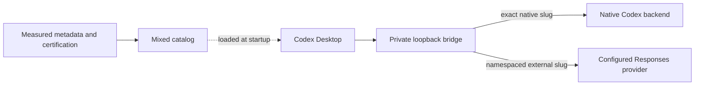

# PickerMux technical guide

This guide collects the operational and technical detail behind the macOS app.
For the short installation walkthrough and DMG download, see the
[README](../README.md). For implementation contracts, see
[Architecture](ARCHITECTURE.md) and [Security](../SECURITY.md).

PickerMux is an unofficial community project. It is not affiliated with,
endorsed by, or supported by OpenAI, Codex, or LM Studio.

## Providers and requirements

PickerMux connects Codex Desktop to external providers through the Responses
API. Native account models and external models share the picker, with separate
routing and credentials.

| Provider kind | Model discovery | Capabilities |
| --- | --- | --- |
| `lmstudio-responses` | Loaded LLMs with measured metadata, or an explicit allowlist. | Responses routing, model-bound tools, and LM Studio-specific adapters. |
| `openai-responses` | Explicit allowlist verified against the provider's `/models` response. | Responses routing and model-bound tools for compatible local or remote providers. |

Providers must implement the required Responses contract, including applicable
streaming and tool roundtrips. Supporting `/v1/chat/completions` alone is not
sufficient. Loaded-model discovery, Efficient Fidelity, and the local
context-compaction adapter are specific to LM Studio.

The companion's first-install default is LM Studio at
`http://127.0.0.1:1234/v1`. For another provider, activate a custom configuration
through the CLI first; subsequent app actions reuse that installed configuration.
There is no provider or credential editor in the current GUI. See
[supported provider kinds](CONFIGURATION.md#supported-provider-kinds) and
[authenticated Responses providers](CONFIGURATION.md#authenticated-responses-compatible-provider).

For a first custom-provider setup after copying the app, invoke its bundled
CLI with a reviewed configuration file, rather than enabling the LM Studio
default first. Keep Codex fully quit; setup may send certification prompts:

```bash
node /Applications/PickerMux.app/Contents/Resources/Backend/bin/pickermux.mjs setup --config /path/to/provider-config.json
```

With LM Link, retain the local LM Studio endpoint: LM Studio forwards inference
to the linked device internally. See
[LM Link API documentation](https://lmstudio.ai/docs/developer/core/lmlink).

The app requires macOS 13+, Apple silicon or Intel, and Node.js 22.15.0 or newer
with native Zstandard support. It validates Node at `/opt/homebrew/bin/node`,
`/usr/local/bin/node`, or `/usr/bin/node`; an interactive-shell-only runtime is
insufficient. It bundles the PickerMux backend, not Node.js. Check the runtime
with `node --version`; reopen the terminal after installing Node.js if necessary.

Codex must have been opened while signed in to create an account model cache
matching its installed client version. Cache age alone does not invalidate a
matching snapshot. Native models appear only if the signed-in account is
entitled to them. Fully quit Codex before changing its integration or catalog.

## Installation and upgrades

The end-user distribution is a universal DMG. Open it, drag **PickerMux.app** to
Applications, eject the image, then run the copied app. The image contains the
app and an Applications shortcut. Copying it does not install the integration,
modify Codex configuration, or send provider requests. Turn on **Use PickerMux
in Codex** with Codex fully closed to authorize setup.

Setup uses a fresh configuration preview, verified backup, lifecycle lock, and
rollback. It preserves unrelated user settings and rejects concurrent edits.
It can replace a recognized Ollama gateway; an unknown gateway or modified
managed state requires review. PickerMux retains an explicit provider to keep
the qualified HTTP/SSE transport and zero-retry settings.

Setup certifies discovered models without a valid base tool receipt after the
installation transaction. This sends live test prompts and can take several
minutes per model. Existing valid certifications are retained. If certification
fails, installation may be retained with certification incomplete; models
without valid evidence remain text-only or blocked pending recovery. Keep the
configured models available, run `pickermux doctor`, then use
`pickermux certify --all` to retry. See
[certification recovery](TROUBLESHOOTING.md#installation-completes-but-model-certification-does-not).

The installed CLI is exposed as `~/.local/bin/pickermux`; managed versioned
distribution files live under `~/Library/Application Support/PickerMux`.
The source checkout is separate from the installed runtime. Setup runs as the
current user, without `sudo` or automatic shell-profile edits. Use the absolute
CLI path if `~/.local/bin` is absent from `PATH`.

For an app upgrade, quit PickerMux before replacing its bundle from the new DMG.
App and installed CLI/runtime versions are distinct: copying the bundle alone
does not activate a new installed backend. The new app offers an explicit
upgrade from its verified bundled payload while Codex is closed and reuses the
installed provider configuration. Review and authorize the proposed change.
PickerMux does not update silently. Valid certifications are preserved; failed
installation activation restores the previous state. A retained installation
with incomplete certification is reported separately.

Update checks in Settings identify the public DMG release and open its download.
App replacement happens through the DMG; no separately published CLI archive is
required. See [the companion guide](MACOS_COMPANION.md) for the exact action
labels and supported states.

Earlier CLI-only releases offered an archive, release manifest, checksums, and
`install.sh`. Their pinned assets remain useful for historical recovery; do not
expect `releases/latest/download/install.sh` in a DMG-only release. Do not
substitute source files into a receipt-owned runtime or bypass an immutable
package checksum mismatch. See [Releasing](RELEASING.md) for provenance,
Developer ID signing, notarization, and Gatekeeper checks.

Reopen Codex after setup or refresh. Its catalog loads at process startup:
closing a window does not suffice; use **Codex → Quit Codex** or **Command-Q**.

### Verify the installation

```bash
~/.local/bin/pickermux --version
~/.local/bin/pickermux status
~/.local/bin/pickermux doctor
~/.local/bin/pickermux discover
```

Compare the CLI version with the app version in Settings. `status` checks
managed configuration, catalog, compatibility, bridge, and recovery phase.
`status --json` exposes `fullRefresh.status` and `fullRefresh.phase`. `discover`
lists models under the installed discovery policy.

`doctor` is deterministic and sends no model prompt. Its independent
`codex-account-cache` check can inspect the signed-in cache even when the bridge
or mixed catalog is absent. `doctor --live` adds a real provider inference check
and should be used intentionally. See
[CLI and Node troubleshooting](TROUBLESHOOTING.md#companion-cannot-find-or-validate-the-cli-or-nodejs).

## Daily use and discovery

Make your provider models available, fully quit Codex, refresh the picker,
then reopen Codex and select a namespaced external model. The app offers
**Refresh picker** and **Open Codex**; the equivalent refresh is:

```bash
pickermux refresh
```

Ordinary refresh does not send certification prompts, quit Codex, or perform
full account-cache recovery. Models discovered after setup need explicit
certification before tool access.

LM Studio's default `loaded` mode reads `/api/v1/models` metadata and publishes
only loaded LLMs with a confirmed context size. It excludes embeddings, unloaded
models, invalid identifiers, and foreign namespaces. Multiple instances of one
model use the smallest reported context. Models below 32,768 tokens show a
picker warning; their real context value is preserved.

Provider discovery pauses while Codex runs. When synchronization is permitted,
an intentionally stopped LM Studio server produces a native-only catalog; a
disappearing selected model returns to the configured native fallback. Transient
errors retain the last known good catalog. A Codex version mismatch stops
refresh before provider discovery or credential lookup and retains existing
catalog and account-cache files.

The app polls status and shows a completion time for manual checks. Settings
offers login startup, notifications, refresh after Codex fully closes, and
update checks. Automatic refresh and notifications are off by default. Automatic
refresh never repairs mismatches, certifies models, updates software, or quits
Codex. A status check inspects installation state; it does not retry setup or
prove the model server is reachable. [Full companion guide](MACOS_COMPANION.md).

## Tool certification

New external models start without tools or shell access. Base live certification
checks text, streaming, direct functions, parameterless functions, namespaced
JSON/streamed functions, tool results, and long-context behavior. A base pass
grants Direct fidelity, bound to the exact provider, model, context, capability
metadata, and Codex client version.

For LM Studio, an additional tool-search probe can grant Efficient Fidelity.
If that additive evidence fails or becomes stale while the base receipt remains
valid, the model retains Direct fidelity. Missing or stale base evidence means
text-only operation or quarantine pending recovery. No provider-wide switch
bypasses certification.

Setup certifies models missing a valid base receipt. To retest manually, use
**Certify models…** in the app or:

```bash
pickermux certify --model lmstudio/example-model
pickermux certify --all
```

Use the exact discovered public slug. Do not certify alongside an active
provider-model turn. Certification blocks new ordinary requests to the target
and publishes a conservative catalog before enabling the private probe transport.
An already admitted request may finish. An interrupted transition leaves the
model quarantined; correct the reported problem and rerun the same certification.
Receipts store outcomes and fingerprints, never prompts, responses, or credentials.

### Efficient Fidelity and text-only performance

An Efficient Fidelity-certified LM Studio model keeps Codex's complete agent
instructions and conversation. Codex searches its deferred tool inventory and
supplies selected public schemas for the next inference. Non-deferred functions
remain available. PickerMux translates the roundtrip; it does not choose or
execute tools, approve actions, or run a separate agent. The current path uses
full replay rather than provider-side `previous_response_id` state.
See [Efficient Fidelity architecture](ARCHITECTURE.md#efficient-fidelity).

Uncertified text-only LM Studio routes instead use a compact assistant profile
and omit only generated bootstrap fragments whose provenance and shape are
verified. User messages, attachments, history, project instructions, current
environment facts, and selected skill instructions are retained. Unknown or
malformed fragments remain untouched. Certified models receive the full coding
harness. Privacy-safe byte/part counters in `doctor` contain no prompt text,
model/provider identities, paths, or request identifiers.

These optimizations reduce input-prefill work, not token-generation time.
Hardware, quantization, loaded context, project instructions, and history still
affect latency. Compare uncached prompt tokens and time to first output in the
provider log using a new short conversation. See
[slow first-token troubleshooting](TROUBLESHOOTING.md#lm-studio-takes-minutes-before-the-first-token)
and the [Fast Agent feasibility report](FAST_AGENT_FEASIBILITY.md).

## Web search and context compaction

Tool-certified external models can use Codex's client-executed `web.run`.
Codex performs the search through its native service, returns source text, and
lets the selected external model write the answer. Search uses native credentials
only on the native route; it requires no extra provider key. PickerMux makes no
additional external inference call to execute a search and does not cache or
truncate search results.

Search requires native search access and an exact valid tool certification.
`bridge.webSearchModel`, or `bridge.defaultModel` when omitted, identifies the
native service request parameter; it does not change the answer model or prove
the backend's internal model or billing. Existing disabled search settings
remain respected. Ask for a sourced lookup and confirm an actual tool execution;
an answer containing a link alone is insufficient. See
[search configuration](CONFIGURATION.md#shared-web-search),
[search acceptance](WEB_SEARCH_ACCEPTANCE.md), and
[search troubleshooting](TROUBLESHOOTING.md#web-search-is-missing-or-fails).

LM Studio's context-compaction adapter translates Codex's supported contract
into a bounded text summary request. It retains conversation messages, tool
results, and URLs while omitting separately supplied current base instructions
that Codex resends on ordinary turns. The summary has no tool authority. Output
is validated and encrypted with installation-, provider-, model-, and
context-bound state before Codex receives a compaction item.

Ordinary requests add no summary call. Summaries are lossy, and models are not
guaranteed to interpret history correctly. Normal refresh and upgrades retain
the installation key; full recovery or reinstallation replaces it, invalidating
earlier encrypted continuations. Other providers do not inherit this adapter.
See [compaction configuration](CONFIGURATION.md#lm-studio-context-compaction)
and [compaction architecture](ARCHITECTURE.md#lm-studio-context-compaction).

## Codex update recovery

After an update, inspect **Check status**, **Check installation**, or:

```bash
pickermux status
pickermux doctor
```

For modified managed configuration, review the edit through
[configuration recovery](TROUBLESHOOTING.md#uninstall-refuses-modified-configuration)
before retrying setup. Do not use full refresh to overwrite edited state.

For an intact installation with outdated account visibility, use **Repair after
a Codex update…** or run the receipt-active installed CLI:

```bash
pickermux refresh --full
```

This opt-in operation explains two graceful Codex quits and possible task
interruption, then requires the exact confirmation `FULL` in the CLI. `--FULL`
is an alias, but `--json` and `--config` cannot accompany full refresh.
An independent helper suspends PickerMux, opens Codex natively, waits for a
newly valid account cache, quits Codex again, transactionally reactivates
PickerMux, and reopens Codex. Installed settings, receipts, backups, and provider
credentials are retained; earlier encrypted compaction continuations expire.

The helper never forces a refused or timed-out quit. A private checkpoint allows
an interrupted recovery to resume after fresh confirmation. Edits to temporary
native configuration block reactivation. A bridge quarantined after a client
update can schedule recovery if its ownership proofs remain intact. See
[full-refresh troubleshooting](TROUBLESHOOTING.md#full-account-cache-refresh-stops-before-completion).

If integration is absent, first open Codex while signed in until its native
picker loads, fully quit, then set up PickerMux with the intended configuration.
Do not delete Codex authentication or account model caches as a workaround.

## Deactivation and removal

Turning **Use PickerMux in Codex** off stops the bridge and removes active
integration references, while retaining CLI, runtime, provider settings,
certifications, and backups. The mixed catalog retained on disk is inactive.
Fully quit and reopen Codex to load the native picker. Reactivation checks the
retained ownership and configuration before restoring the integration.

For complete removal, fully quit Codex and use **Settings → Remove PickerMux
completely…**. Its fresh preview and explicit confirmation authorize native
Codex restoration, owned runtime/CLI removal, verified backup deletion, and
deletion of registered PickerMux provider credentials. Login startup must first
be verified disabled. Native sign-in, model caches, projects, chats, and unrelated
settings remain. The equivalent command is:

```bash
pickermux uninstall --purge --restore-native
```

Native restoration omits only receipt-recorded root model, provider, catalog,
reasoning, and gateway overrides. It does not reactivate an earlier Ollama
gateway. Foreign, edited, ambiguous, or concurrently changed routing state blocks
this mode; it cannot be combined with `--force`. Complete app removal requires
the receipt-validated installed CLI's native-removal capability (0.9.5+), rather
than a fallback purge from the bundled setup backend.

After success, quit PickerMux, move its app from Applications to the Trash in
Finder, and reopen Codex. If the app reports that integration and CLI are already
absent, only its bundle remains. Partial or unknown state is reported separately.
The app does not recursively delete its own bundle.

| CLI mode | Scope |
| --- | --- |
| `uninstall` | Restore previous Codex configuration; remove integration, LaunchAgent, and runtime. |
| `uninstall --remove-cli` | Also remove the receipt-owned launcher and CLI distribution. |
| `uninstall --purge` | Also delete verified backups and registered provider credentials. |
| `uninstall --purge --restore-native` | Full owned removal with native defaults instead of the previous gateway. |

The first three modes restore the previous configuration, which may contain an
older Ollama integration. The first two retain backups and credentials. Every
mode rejects unrecognized deletion targets. Purge inventories exact paths,
hashes, ownership, and device/inode identity; it never recursively deletes an
untrusted directory. Keychain deletions cannot be rolled back: a partial failure
retains recovery state and reports incomplete removal. See
[the purge security boundary](../SECURITY.md#uninstall-and-purge-boundary).

Canonical installations retain an inert `model_bridge` provider table so older
chats can open. It has no credentials, catalog models, or usable provider route.
Changing the selected model may leave a historical chat's saved provider on
`model_bridge`. To continue that chat natively, follow
[native-provider recovery](TROUBLESHOOTING.md#reconnecting-in-an-old-chat-after-deactivation-or-uninstall).
A later installation removes only the exact unchanged compatibility table.

### Repair historical chats

If an older uninstall broke chats with “Model provider `model_bridge` not found,”
fully quit Codex and use `pickermux repair-chats`. It restores only the inert
table, without setup, inference, or a current account cache. A trusted source
checkout can run `node bin/pickermux.mjs repair-chats` from its repository root.

The historical 0.8.3 release provides a pinned repair-only installer:

```bash
/usr/bin/curl --proto '=https' --proto-redir '=https' --tlsv1.2 -fsSL https://github.com/patrickschiller/pickermux/releases/download/v0.8.3/install.sh | /bin/sh -s -- --repair-chats
```

This legacy installer verifies its payload and does not run setup. Download and
inspect the script first if required by your threat model; its bootstrap trusts
HTTPS, GitHub, and the release publisher. This repair restores parsing
compatibility only; it does not migrate a chat's saved provider. See
[historical chat recovery](TROUBLESHOOTING.md#historical-chats-cannot-load-model_bridge)
and [native-provider recovery](TROUBLESHOOTING.md#reconnecting-in-an-old-chat-after-deactivation-or-uninstall).

## Routing and security



The bridge listens only on `127.0.0.1` behind a random private capability path.
Each public slug resolves to one immutable route; unknown, ambiguous, or prefix
matches fail before provider I/O. Native requests preserve qualified request
and response bytes. External requests use narrow body/header allowlists and
only the selected provider's credentials.

PickerMux never reads `~/.codex/auth.json`. Native tokens, cookies, account
identifiers, attestation values, and Codex metadata never reach an external
provider. Persistent provider credentials can use provider-specific Keychain
items; secrets stay out of configuration, receipts, and status. Inline secrets,
URL credentials, wildcard model lists, unapproved private-network targets,
unsafe ownership, and malformed input fail closed.

Managed files remain private. Lifecycle changes use locks, ownership receipts,
compare-and-swap checks, staging, and rollback. Compatibility mismatches
quarantine model traffic while preserving privacy-safe status and diagnosis.
The app uses fixed protocol actions, validated executables, narrow environments,
bounded output, and fixed GUI text. It never edits Codex TOML or private lifecycle
files directly.

Read [SECURITY.md](../SECURITY.md) before sharing diagnostics or reporting a
vulnerability. Remove credentials, account identifiers, usernames, private model
data, capability paths, and unredacted logs from reports and screenshots.

## CLI reference

Run `pickermux help` or `pickermux --help` for the compact reference.
`bin/lmstudio-picker.mjs` remains a compatibility alias. From a development clone,
replace `pickermux` with `./bin/pickermux.mjs`.

| Command | Purpose |
| --- | --- |
| `--version` | Report the exact CLI version. |
| `setup [--config PATH] [--json]` | Install/upgrade and certify models missing a valid base receipt. |
| `discover` | List models under the configured discovery policy. |
| `build` | Build and validate a catalog without installation. |
| `install` | Install integration/service, then certify missing base receipts. |
| `refresh` | Rediscover models and transactionally refresh catalog/runtime. |
| `refresh --full` | Confirm native account-cache recovery and reactivation. |
| `status [--json]` | Inspect managed state and compatibility. |
| `doctor` / `doctor --live` | Deterministic checks / additional real inference. |
| `certify --model SLUG` / `certify --all` | Live model-bound certification. |
| `repair-chats [--json]` | Restore an inert historical-chat provider table. |
| `credential-set PROVIDER` | Store an interactively entered credential in Keychain. |
| `credential-status PROVIDER` | Report credential availability without its value. |
| `credential-delete PROVIDER` | Delete the named provider's Keychain item. |
| `uninstall [--remove-cli \| --purge] [--restore-native]` | Owned removal; native mode requires purge. |
| `companion status` / `companion run` | Secret-free GUI snapshots / bounded stdin requests. |

## Limits and development

- macOS only; the companion requires macOS 13+.
- Catalog changes require a full Codex restart, with no supported live reload.
- Provider compatibility requires the reviewed Responses contract.
- Quality, tool decisions, and latency depend on model, context, quantization,
  hardware, and provider configuration; certification does not guarantee every
  task outcome.
- Setup, live diagnosis, and certification can send real inference requests.
- Full refresh changes application and service state, requiring target-Mac
  acceptance beyond isolated state-machine tests.
- Native model visibility and search depend on account access.
- Efficient Fidelity optimizes deferred schemas, not the rest of the harness
  or conversation; compaction has separate model-bound recovery limits.

For development, clone the repository and run the offline checks:

```bash
git clone https://github.com/patrickschiller/pickermux.git
cd pickermux
npm run verify
```

The runtime has no third-party npm dependencies. CI checks supported Node.js
versions on macOS. The companion adds Swift protocol, process, ownership,
login/removal, and lifecycle tests plus a universal build. Signing, notarization,
Gatekeeper, and real Codex/provider acceptance are separate checks.
See [Contributing](../CONTRIBUTING.md),
[companion development](MACOS_COMPANION.md#development-and-distribution),
[Releasing](RELEASING.md), and [Troubleshooting](TROUBLESHOOTING.md).
